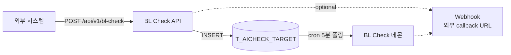

# API 스펙 (외부 시스템 연동)

> **상태**: 설계 중. 운영팀과 협의 진행 중.

외부 시스템이 BL Check 를 트리거하는 HTTP API.

## 현재 구조 (변경 전)


→ 외부 시스템에 DB 접속 권한 부여 필요. 보안 / 결합도 ↑.

## API 화 후 구조



→ 외부는 HTTP 만, 우리 DB 노출 없음. 보안 / 결합도 ↓.

## 권장 방식: 비동기 (fire-and-forget)

### Endpoint

```http
POST /api/v1/bl-check
Content-Type: application/json
Authorization: Bearer <api_key>

{
  "blno": "SNKO010260504188"
}
```

### Response (즉시, ~100ms)

```http
HTTP/1.1 202 Accepted
Content-Type: application/json

{
  "blno": "SNKO010260504188",
  "status": "queued",
  "queued_at": "2026-05-21T10:30:00+09:00"
}
```

### 처리

```
1. 외부 → POST 호출
2. 우리 API: T_AICHECK_TARGET 에 INSERT (CHECKTP='I')
3. 즉시 "queued" 응답
4. cron 5분 폴링이 처리 (최대 5분 지연)
5. 결과는 T_BLCHECK_AUTO_H/D 에 저장
6. 외부 시스템은 결과 확인 (운영 화면 또는 GET 조회 API)
```

## 결과 조회 API (옵션)

```http
GET /api/v1/bl-check/{blno}/status
Authorization: Bearer <api_key>
```

### Response

```json
{
  "blno": "SNKO010260504188",
  "checked": true,
  "pass": "Y",
  "checked_at": "2026-05-21T10:35:00+09:00",
  "results": [
    {
      "rule_code": "001",
      "rule": "BANK 명칭이...",
      "pass": "Y",
      "block": "SHIPPER",
      "reason": "BANK 정보 없음, 정상"
    },
    ...
  ]
}
```

`checked=false` (아직 처리 안 됨):

```json
{
  "blno": "SNKO010260504188",
  "checked": false,
  "queued_at": "2026-05-21T10:30:00+09:00"
}
```

## 인증 방식 (협의 중)

| 방식 | 장점 | 단점 |
|---|---|---|
| **API Key** (Bearer 헤더) | 단순, 외부 시스템 부담 적음 | 키 노출 시 위험 |
| **JWT** | 만료 / 권한 분리 가능 | 외부에 JWT 라이브러리 필요 |
| **IP 화이트리스트** | 키 관리 불필요 | 외부 IP 변경 시 매번 수정 |

→ **권장: API Key + IP 화이트리스트 병행**.

## 에러 응답

| HTTP | Body | 의미 |
|---|---|---|
| 400 | `{"error": "invalid_blno", "message": "..."}` | BL 번호 형식 오류 |
| 401 | `{"error": "unauthorized"}` | 인증 실패 |
| 409 | `{"error": "already_queued", "message": "..."}` | 이미 큐에 있음 (재호출) |
| 500 | `{"error": "internal_error"}` | 내부 오류 |

## 호출 예시 (curl)

```bash
# BL 적재
curl -X POST https://api.example.com/api/v1/bl-check \
  -H "Content-Type: application/json" \
  -H "Authorization: Bearer YOUR_API_KEY" \
  -d '{"blno": "SNKO010260504188"}'

# 결과 조회
curl https://api.example.com/api/v1/bl-check/SNKO010260504188/status \
  -H "Authorization: Bearer YOUR_API_KEY"
```

## 구현 계획 (예정)

FastAPI 기반:

```python
from fastapi import FastAPI, HTTPException, Header
from pydantic import BaseModel

app = FastAPI(title="BL Check API", version="1.0")

class BLCheckRequest(BaseModel):
    blno: str

@app.post("/api/v1/bl-check", status_code=202)
async def add_bl(req: BLCheckRequest, authorization: str = Header(...)):
    # 1. 인증
    if not verify_api_key(authorization):
        raise HTTPException(status_code=401, detail="unauthorized")

    # 2. BL 번호 형식 검증
    if not is_valid_blno(req.blno):
        raise HTTPException(status_code=400, detail="invalid_blno")

    # 3. T_AICHECK_TARGET INSERT
    db.execute(
        "INSERT INTO T_AICHECK_TARGET (BLNO, CHECKTP, INPDATE) VALUES (:1, 'I', SYSTIMESTAMP)",
        [req.blno],
    )
    db.commit()

    return {
        "blno": req.blno,
        "status": "queued",
        "queued_at": datetime.now(timezone(timedelta(hours=9))).isoformat(),
    }

@app.get("/api/v1/bl-check/{blno}/status")
async def get_status(blno: str, authorization: str = Header(...)):
    if not verify_api_key(authorization):
        raise HTTPException(status_code=401, detail="unauthorized")

    # T_BLCHECK_AUTO_H 조회 (가장 최근 SRC='AI' row)
    row = db.execute(
        "SELECT PASS, INPDATE FROM T_BLCHECK_AUTO_H WHERE BLNO=:1 AND SRC='AI' ORDER BY INPDATE DESC FETCH FIRST 1 ROWS ONLY",
        [blno],
    ).fetchone()

    if not row:
        return {"blno": blno, "checked": False}

    return {"blno": blno, "checked": True, "pass": row[0], "checked_at": row[1]}
```

## 운영팀 회신 (협의 중)

운영팀에 다음 항목 확인 요청 보낸 상태:

1. 인증 방식 선호 (API Key / JWT / IP 화이트리스트)
2. Request 추가 메타데이터 필요 여부
3. 결과 통보 방식 (운영 화면 / 조회 API / Webhook)
4. 예상 호출량

회신 받으면 OpenAPI 3.0 스펙 작성 + 본 문서 업데이트.

## 관련 문서

- [아키텍처](../tech/architecture.md)
- [데이터 모델](../tech/data-model.md)
