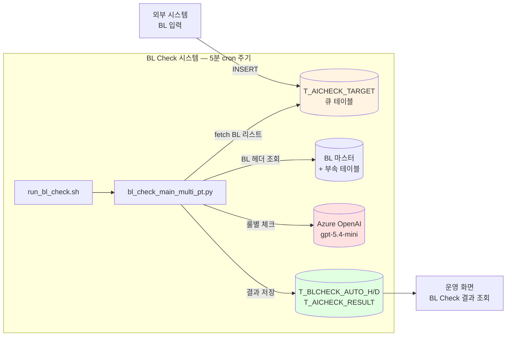

# BL Check (AI) · 운영 가이드

신코르 해운 BL (Bill of Lading) 자동 체크 시스템의 코드 구조, 데이터 모델, 운영 방법을 다룹니다.

## 한눈에 보는 시스템

## 주요 기능

| 기능 | 설명 |
|---|---|
| **BL 룰 기반 체크** | 33+ 종의 룰 (송하인/수하인/통지처/마크/디스크립션 등) 을 LLM 으로 자동 검증 |
| **포트 별 룰 적용** | 항만 (POL/POD) 마다 다른 룰 적용 (INCCU=NEPAL, CNSHA, etc.) |
| **HYBRID 체인** | Chain A (일반 룰) + Chain B (Mark/Description 가드) 동시 호출 |
| **자동 큐 처리** | cron 5분 주기로 신규 BL 자동 체크 |
| **결과 통합** | AI 결과 + 휴먼 검토 결과를 동일 테이블에 SRC 로 구분하여 저장 |

## 핵심 코드 파일

| 파일 | 역할 |
|---|---|
| [`run_bl_check.sh`](../run_bl_check.sh) | cron 진입 스크립트 (flock, timeout, 환경변수) |
| [`bl_check_main_multi_pt.py`](../bl_check_main_multi_pt.py) | 메인 오케스트레이션 (asyncio + ThreadPool) |
| [`database_management/database_handler.py`](../database_management/database_handler.py) | DB 호출 함수 모음 |
| [`oracle_db/oracle_store.py`](../oracle_db/oracle_store.py) | Oracle 커넥션 풀 + 프로시저 호출 |
| [`LLM_extractor/`](../LLM_extractor/) | LLM 체인 (PartyInfoChecklist, MDGuard) |
| [`pycomms_toolkit/`](../pycomms_toolkit/) | 공통 유틸 (룰 처리, 텍스트 정제 등) |

## 문서 네비게이션

- **[아키텍처](tech/architecture.md)** — 시스템 구성, 디렉터리 구조
- **[데이터 모델](tech/data-model.md)** — DB 테이블, 컬럼, 관계
- **[AI 파이프라인](tech/ai-pipeline.md)** — BL 1건 처리 흐름
- **[룰 정의](tech/rules.md)** — 룰 종류와 적용 방식
- **[배포](tech/deployment.md)** — cron 설정, 환경변수
- **[운영 매뉴얼](operations/runbook.md)** — 일상 운영 작업
- **[트러블슈팅](operations/troubleshooting.md)** — 장애 대응
- **[API 스펙](api/README.md)** — 외부 시스템 연동 (설계 중)

## 환경 정보

| 항목 | 값 |
|---|---|
| **Python** | 3.11 (uv 관리) |
| **OS** | Ubuntu 24.04 LTS |
| **DB** | Oracle 19c+ (LINER 계정) |
| **LLM** | Azure OpenAI (sinokor-gpt.openai.azure.com) — gpt-5.4-mini |
| **실행 환경** | isteam1 서버 |
| **작업 디렉토리** | `/home/dev01/seunghyun/project/고객지원팀/bl_check_management_arrange - final_kr/` |
