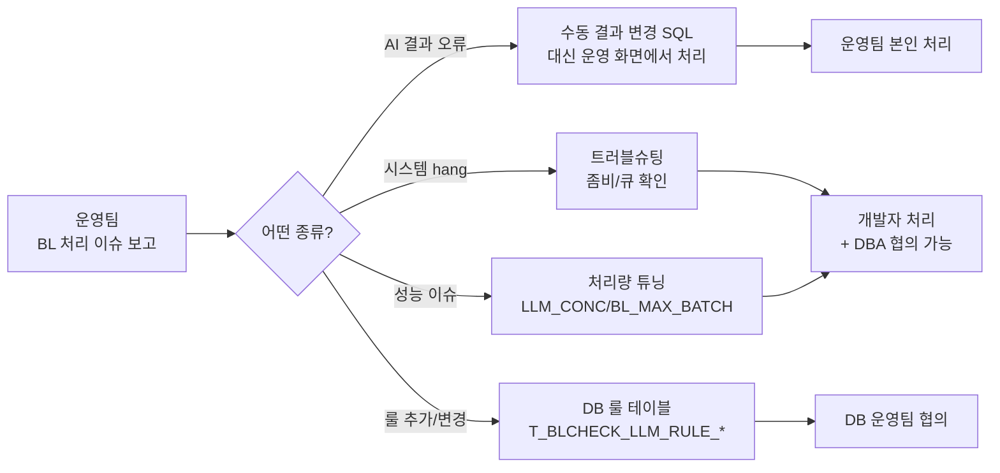

# 일상 운영 매뉴얼

BL Check 시스템을 안정적으로 운영하기 위한 일상 작업 가이드.

## 일일 체크 (5분)

### 1) cron 정상 발화 + 최근 사이클 결과

```bash
tail -30 "/home/dev01/seunghyun/project/고객지원팀/bl_check_management_arrange - final_kr/logs/bl_check_$(date +%Y-%m-%d).log" | grep -E "START|END|완료:|FAIL"
```

**정상 패턴:**
```
[HH:MM:01] START run_idx=...
완료: 성공 20건 / 실패 0건
총 소요 시간: 25.96초
[HH:MM:30] END rc=0
```

→ 매 5분 단위로 START / END rc=0 이 반복되면 정상.

### 2) 큐 상태 점검 (DBeaver)

```sql
SELECT CHECKTP, COUNT(*) FROM LINER.T_AICHECK_TARGET GROUP BY CHECKTP;
```

| CHECKTP | 정상 범위 | 비정상 |
|---|---|---|
| `'I'` | 0 ~ 수십 건 | 100건+ 누적 = 처리 지연 |
| `'U'` | 0 ~ 20 (현재 사이클 진행 중인 것만) | 50건+ = hang 가능성 |

비정상이면 [트러블슈팅](troubleshooting.md) 참고.

### 3) 좀비 세션 확인

```sql
SELECT sid, serial#, status, last_call_et
FROM v$session
WHERE username='LINER' AND machine='isteam1'
  AND status='ACTIVE' AND last_call_et > 60;
```

→ 결과 0건이면 정상. 1건+ 이면 좀비 발생 (수 분 이상 진행 중).

## 주간 체크 (10분)

### 4) 디스크 사용량

```bash
df -h /home/dev01                # 전체 디스크
du -sh ".../bl_check.../"        # 프로젝트 크기
du -sh ".../output/"             # output 디렉토리
ls ".../output/run*" | wc -l     # 사이클 디렉토리 수
```

→ 디스크 80% 이상이면 정리 작업 필요.

### 5) output/ 디렉토리 정리

영구 누적되는 debug dump. 매주 정리:

```bash
# 7일 이상 된 사이클 디렉토리 삭제
find "/home/dev01/seunghyun/project/고객지원팀/bl_check_management_arrange - final_kr/output/" \
    -maxdepth 1 -name "run*" -type d -mtime +7 -exec rm -rf {} \;
```

또는 cron 추가하여 자동화:
```
0 3 * * * find ".../output/" -maxdepth 1 -name "run*" -type d -mtime +7 -exec rm -rf {} \;
```

### 6) 처리량 분석

```sql
-- 최근 7일 일별 처리량
SELECT TO_CHAR(INPDATE, 'YYYY-MM-DD') AS day,
       COUNT(DISTINCT BLNO) AS bl_cnt,
       COUNT(*) AS rule_cnt
FROM LINER.T_AICHECK_RESULT
WHERE INPDATE >= TRUNC(SYSDATE) - 7
GROUP BY TO_CHAR(INPDATE, 'YYYY-MM-DD')
ORDER BY day DESC;
```

→ 일별 BL 수가 일정한지, 갑자기 감소했는지 확인.

## 임시 운영 작업

### 큐 'U' → 'I' 수동 reset (누적 시)

큐 'U' 가 100건+ 누적되어 자동 회복이 안 될 때:

```sql
UPDATE LINER.T_AICHECK_TARGET SET CHECKTP='I' WHERE CHECKTP='U';
COMMIT;
```

→ 'U' 잠금 풀어서 다음 사이클이 재처리.

### 특정 BL 만 수동 처리

특정 BL 들만 일회성으로 돌리고 싶을 때:

```bash
# 1. BL 리스트 파일 작성
cat > /tmp/my_bls.txt <<EOF
SNKO010260504188
SNKO010260400097
EOF

# 2. cron 일시 중단
crontab -l > /tmp/crontab.bak.$(date +%Y%m%d_%H%M)
crontab -r

# 3. 수동 실행 (BL_LIST_FILE 환경변수)
cd ".../bl_check_management_arrange - final_kr"
BL_LIST_FILE=/tmp/my_bls.txt bash run_bl_check.sh

# 4. cron 복구
crontab /tmp/crontab.bak.YYYYMMDD_HHMM
```

### 처리량 늘리기 / 줄이기

```bash
# /run_bl_check.sh 의 환경변수 기본값 수정
LLM_CONC="${LLM_CONC:-10}"          # 동시 LLM 호출
export BL_MAX_BATCH="${BL_MAX_BATCH:-20}"   # 사이클당 BL 수
```

권장 단계:
- **현재:** LLM_CONC=10, BL_MAX_BATCH=20 → 시간당 240건
- **증대 1단계:** LLM_CONC=15, BL_MAX_BATCH=30 → 시간당 360건
- **증대 2단계:** LLM_CONC=20, BL_MAX_BATCH=40 → 시간당 480건

→ 1주일씩 안정성 확인 후 단계적 증대.

### 수동 결과 변경 (AI FAIL → 휴먼 PASS)

운영팀이 AI 결과를 뒤집어야 할 때 (예: rule 007 같이 적용 범위 오류):

```sql
-- 1. AUTO_D 의 룰을 PASS 로 변경
UPDATE LINER.T_BLCHECK_AUTO_D
SET CHKTP='PASS',
    ENGERRMSG='[수동] 적용 범위 외 — 통과 처리',
    LOCERRMSG='[수동] 적용 범위 외 — 통과 처리'
WHERE BLNO IN ('SNKO010260504188', 'SNKO010260400097')
  AND SRC='AI'
  AND ERRORLINE='007';

-- 2. AUTO_H 의 전체 PASS 처리 (다른 FAIL 룰 없을 경우만)
UPDATE LINER.T_BLCHECK_AUTO_H
SET PASS='Y'
WHERE BLNO='SNKO010260504188'
  AND SRC='AI';

COMMIT;
```

⚠ AUTO_H 의 PASS='Y' 처리는 **다른 룰이 모두 PASS 일 때만** 수행. 일부 FAIL 남아있으면 'N' 그대로 두기.

## 코드 / 프로시저 변경 시

### Python 코드 변경

```bash
cd "/home/dev01/seunghyun/project/고객지원팀/bl_check_management_arrange - final_kr"

# 1. 코드 수정 후 syntax check
uv run python -c "import bl_check_main_multi_pt"

# 2. 수동 1회 실행 (cron 발화 대기 안 함)
bash run_bl_check.sh

# 3. 로그 확인
tail -50 "logs/bl_check_$(date +%Y-%m-%d).log"
```

### DB 프로시저 변경

`sql/` 디렉토리에 패치 SQL 보관:

```
sql/
├── 2026-05-19_*.sql   # 이전 패치
├── 2026-05-20_rollback_*.sql
└── YYYY-MM-DD_<description>.sql   # 신규 패치는 이런 패턴으로
```

**적용 절차:**
1. SQL 파일 작성 (`CREATE OR REPLACE PACKAGE BODY ...`)
2. DBeaver 에서 실행 (Alt+Shift+X)
3. 확인 쿼리:
   ```sql
   SELECT object_name, object_type, status, last_ddl_time
   FROM all_objects WHERE owner='LINER' AND object_name='PKG_AI_BL_CHECK';
   ```
   → STATUS=VALID, last_ddl_time 방금 시각

4. 수동 1회 실행으로 동작 확인

## 백업 / 복구

### 코드 백업

git 사용 권장 (현재 미사용 상태로 보임). 향후:

```bash
cd ".../bl_check_management_arrange - final_kr"
git init
git add .
git commit -m "Initial commit"
```

### 데이터 백업

DB 측 백업은 별도 DB 운영팀에서 관리. 우리 시스템에서 별도 백업 불필요.

### 설정 파일 백업

```bash
# configs/ 디렉토리 (API 키 등) 정기 백업
tar czf "/tmp/bl_check_configs_$(date +%Y%m%d).tar.gz" \
    ".../bl_check_management_arrange - final_kr/configs/"
```

## 운영팀 협업 흐름



## 긴급 대응

### 시스템 완전 중단

```bash
# 1. cron 중단
crontab -l > /tmp/crontab.bak.$(date +%Y%m%d_%H%M)
crontab -r

# 2. 진행 중 프로세스 강제 종료
pkill -9 -f bl_check_main_multi_pt
rm -f /tmp/bl_check.lock

# 3. 좀비 세션 확인 + DBA KILL (필요 시)

# 4. 정상화 후 복구
crontab /tmp/crontab.bak.YYYYMMDD_HHMM
```

### 시스템 정상화 확인

```bash
# 다음 5분 사이클 결과 확인
tail -f ".../logs/bl_check_$(date +%Y-%m-%d).log" | grep -E "START|END|완료:"
```

→ `완료: 성공 N건 / 실패 0건` + `END rc=0` 이면 정상.

## 참고 자료

- [트러블슈팅](troubleshooting.md)
- [아키텍처](../tech/architecture.md)
- [데이터 모델](../tech/data-model.md)
- [배포 / 환경변수](../tech/deployment.md)
