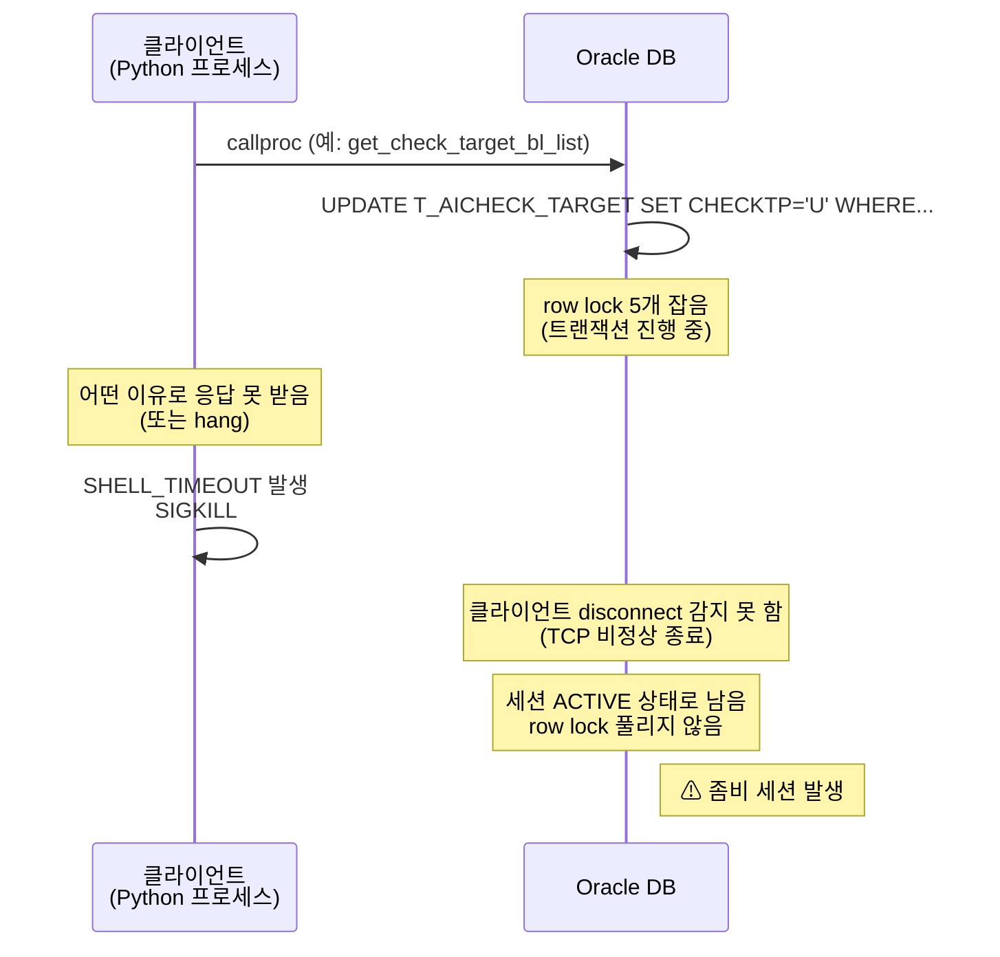

# 트러블슈팅

운영 중 발생할 수 있는 문제와 대응 방법을 정리합니다. **2026-05-19 새벽 좀비 hang 사건 경험 반영.**

## 진단 SQL — 시스템 상태 점검

가장 먼저 실행할 SQL. 큐와 좀비 세션 동시 확인.

```sql
-- 1. 큐 상태
SELECT CHECKTP, COUNT(*) FROM LINER.T_AICHECK_TARGET GROUP BY CHECKTP;

-- 2. 좀비 세션 (LINER, isteam1, ACTIVE 60초+)
SELECT sid, serial#, status, last_call_et, sql_id, event, wait_class
FROM v$session
WHERE username = 'LINER' AND machine = 'isteam1'
  AND status = 'ACTIVE' AND last_call_et > 60
ORDER BY last_call_et DESC;

-- 3. 시간당 처리량 (오늘)
SELECT TO_CHAR(INPDATE, 'HH24') AS hour, COUNT(DISTINCT BLNO) AS bl_cnt
FROM LINER.T_AICHECK_RESULT
WHERE INPDATE >= TRUNC(SYSDATE)
GROUP BY TO_CHAR(INPDATE, 'HH24')
ORDER BY hour;
```

## 증상별 대응

### 증상 1) cron 사이클이 매번 SHELL_TIMEOUT (rc=124)

**로그 패턴:**
```
[YYYY-MM-DD HH:MM:01] START run_idx=...
... (10분 무응답) ...
[YYYY-MM-DD HH:MM:01] [SHELL_TIMEOUT] 사이클이 10분 초과 — 강제 종료됨 (rc=124)
[YYYY-MM-DD HH:MM:01] END rc=124
```

**원인 가능성:**
1. **좀비 세션이 row lock 보유 중** ← 가장 흔함
2. LLM API 응답 지연 (Azure OpenAI 장애)
3. 네트워크 일시 문제

**진단:**
```sql
-- 위 진단 SQL 의 2번 (좀비 세션) 실행
-- last_call_et 가 큰 값 (수 분 ~ 수십 분) 이면 좀비 확정
```

**해결:**
- 좀비 확인 시 → DBA 에게 KILL 요청:
  ```sql
  ALTER SYSTEM KILL SESSION 'sid,serial#' IMMEDIATE;
  ```
- LINER 계정만 있으면 권한 부족 (`ORA-01031`) 발생. **DBA 권한 필요.**

### 증상 2) 'U' 상태 BL 이 비정상 누적 (수백~수천 건)

**현상:** `T_AICHECK_TARGET.CHECKTP='U'` 가 100건 이상 쌓여있음.

**원인:**
- cron 사이클이 hang 또는 timeout 으로 처리 못 함
- 매 사이클이 'I' → 'U' 만 시키고 처리는 일부만 수행

**즉시 회복 (수동):**
```sql
UPDATE LINER.T_AICHECK_TARGET SET CHECKTP='I' WHERE CHECKTP='U';
COMMIT;
```

→ 'U' 잠금 풀어서 다음 사이클이 재처리하도록.

**예방:**
- 매일 새벽 자동 reset cron 추가:
  ```
  0 0 * * * sqlplus -s liner/PWD@DSN <<< "UPDATE LINER.T_AICHECK_TARGET SET CHECKTP='I' WHERE CHECKTP='U'; COMMIT;"
  ```

### 증상 3) `DPY-4024: call timeout exceeded`

**로그 패턴:**
```
Database error occurred: DPY-4024: call timeout of 90000 ms exceeded
Procedure call returned None
처리할 BL이 없습니다.
```

**원인:**
- `oracle_store.py` 의 `connection.call_timeout` 가 설정된 상태에서 DB 호출이 90초 안에 못 끝남
- 보통 좀비 세션의 row lock 충돌

**해결:**
1. 좀비 세션 확인 + DBA KILL
2. timeout 임시 늘리기 (정상화 후 원복):
   ```python
   # oracle_store.py
   conn.call_timeout = 180000  # 90s → 180s
   ```

### 증상 4) `DPY-1001: not connected to database` / `DPI-1010: not connected`

**로그 패턴:**
```
[FAIL][CTX] SNKO... - DPY-1001: not connected to database
DPI-1010: not connected
```

**원인:**
- thick mode + ThreadPoolExecutor worker thread 의 호환성 이슈 (현재 우리는 thin mode 사용)
- 또는 SessionPool 이 invalid connection 반환

**해결:**
- 현재는 thin mode 사용 중이라 발생 가능성 낮음
- 만약 발생 시 → SessionPool 패턴을 DirectPool 로 임시 변경 ([sql/2026-05-20_*.sql](../../sql/) 참고)

### 증상 5) `ORA-00028: your session has been killed`

**로그 패턴:**
```
Database error occurred: DPY-4011: the database or network closed the connection
ORA-00028: your session has been killed
```

**원인:**
- DBA 가 KILL SESSION 했거나
- DB 측 자동 정리

**대응:**
- 일회성이면 무시 (다음 사이클부터 정상)
- 반복되면 DB 측 점검 요청

### 증상 6) BL 처리 결과가 `[FAIL][CTX] - blno 결과 조회되지 않음`

**현상:** 일부 BL 이 자동 삭제됨.

**원인:**
- `sp_GetBlHeader` 호출 결과가 empty (BL Header 가 마스터 테이블에 없음)
- BL 이 이미 출항 완료되어 마스터에서 정리됨

**대응:**
- 정상 동작 (시스템이 자동 처리)
- `[DELETE_TARGET]` + `[EXCEPT_DELETE]` 로그가 함께 나오면 큐에서 자동 삭제됨
- `fail` 카운트 1 증가하지만 운영상 무해

## 좀비 세션 진단 깊이 파기

### 좀비 SQL_ID 추적

```sql
-- 좀비가 실행 중인 SQL 확인
SELECT sql_text FROM v$sql WHERE sql_id = '<SQL_ID>';
```

예: 좀비가 `pkg_ai_bl_check.get_check_target_bl_list` 호출 중이면:
```
begin LINER.pkg_ai_bl_check.get_check_target_bl_list(...); end;
```

### 좀비가 잡고 있는 row lock

```sql
-- 좀비 SID 가 잡고 있는 락 보유 현황
SELECT sid, type, lmode, request, ctime, block
FROM v$lock
WHERE sid = <좀비_SID>;
```

### 좀비 → 신규 cron 사이클 lock 대기 관계

```sql
SELECT s.sid, s.serial#, s.status, s.last_call_et,
       s.blocking_session, s.event
FROM v$session s
WHERE s.username = 'LINER'
ORDER BY s.last_call_et DESC;
```

→ `blocking_session` 컬럼에 좀비 SID 가 표시되면 lock 대기 확정.

## DBA 권한 부족 (`ORA-01031`)

LINER 계정으로 `ALTER SYSTEM KILL SESSION` 실행 시:
```
ORA-01031: 권한이 불충분합니다
```

**대응:**

1. **DBA 에게 요청 메시지 예시:**
   ```
   안녕하세요, 운영 중인 BL Check 시스템에서 좀비 DB 세션이 발생했습니다.
   다음 세션을 KILL 부탁드립니다:

   ALTER SYSTEM KILL SESSION 'sid,serial#' IMMEDIATE;

   - DB: LINER 계정, isteam1 머신
   - SQL: LINER.pkg_ai_bl_check.get_check_target_bl_list
   - 좀비 보유 시간: XX분
   ```

2. **임시 대안 — cron 중단으로 SHELL_TIMEOUT 반복 차단:**
   ```bash
   crontab -l > /tmp/crontab.bak.$(date +%Y%m%d_%H%M)
   crontab -r

   # 정상화 후 복구
   crontab /tmp/crontab.bak.YYYYMMDD_HHMM
   ```

## 좀비 생성 메커니즘 이해



**좀비 방지 (코드 측):**
- `oracle_store.py` 의 `connection.call_timeout` 설정
- 응답 못 받으면 90초 후 자동 abort → 좀비 안 만듦
- 다만 thin mode 의 알려진 SessionPool 이슈로 가끔 발생 가능

**좀비 방지 (DB 측 — DBA 협의 필요):**
- `SQLNET.EXPIRE_TIME` (sqlnet.ora) 설정 → dead client 자동 감지
- TCP keepalive 짧게 (OS 레벨)
- User profile 의 `IDLE_TIME` 단축

## 사건 이력 (참고)

### 2026-05-19 새벽 좀비 hang 사건

- 13:49 — GTT 프로시저 테스트 호출이 hang 됨 (좀비 세션 발생)
- 14:00 이후 — 모든 cron 사이클이 좀비 row lock 에 막혀 SHELL_TIMEOUT 반복
- 15:40 — DBA 가 좀비 세션 KILL
- 새벽까지 ~14시간 동안 큐 858건 누적
- 오전 9시 — 프로시저 롤백 + 사용자가 `UPDATE 'U' → 'I'` 수동 실행으로 정상화
- 시간당 100~135건씩 자연 정리

**교훈:**
- 운영 중 단발성 DB 테스트는 항상 짧은 timeout + try/finally + close 보장
- 좀비 생성 시 DBA 권한 없으면 정상화 어려움 → 사전 협의 필요
- 프로시저 패턴: SKIP LOCKED 가 좀비 영향 회피에 효과적 (테스트 검증 후 운영 반영 권장)

## 일상 점검 체크리스트

매일 1회 (또는 주 1~2회):

```bash
# 1. cron 정상 발화 확인
journalctl -u cron --no-pager -n 20 | grep bl_check

# 2. 최근 사이클 로그 확인
tail -50 ".../logs/bl_check_$(date +%Y-%m-%d).log"

# 3. 디스크 사용량
df -h /home/dev01
du -sh ".../output/"

# 4. 큐 상태 (DBeaver)
# SELECT CHECKTP, COUNT(*) FROM LINER.T_AICHECK_TARGET GROUP BY CHECKTP;

# 5. 좀비 세션 (DBeaver)
# SELECT sid, serial#, status, last_call_et FROM v$session
# WHERE username='LINER' AND machine='isteam1' AND status='ACTIVE' AND last_call_et > 60;
```

→ 모두 정상이면 OK. 하나라도 비정상이면 이 문서의 증상별 대응.

## 참고 자료

- [아키텍처](../tech/architecture.md)
- [데이터 모델](../tech/data-model.md)
- [AI 파이프라인](../tech/ai-pipeline.md)
- [배포 / 환경변수](../tech/deployment.md)
