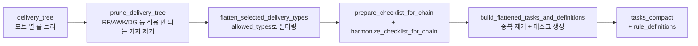

# AI 파이프라인

BL 1건이 LLM 으로 검증되어 결과가 저장되기까지의 흐름을 단계별로 설명합니다.

## 한눈에 보는 파이프라인

```mermaid
flowchart TD
    A[BL 리스트 fetch] --> B[asyncio.gather batch_size=10]
    B --> C[handle_one_with_timeout<br/>BL 당 5분 timeout]
    C --> D[handle_one]

    D --> E1[1. load_bl_context<br/>ThreadPoolExecutor]
    E1 --> E2["DB 조회 (병렬):<br/>• sp_GetBlHeader<br/>• T_OCSH009_D2/D3 (마크/디스크립션)<br/>• T_OCSH001_H (CNSHA)<br/>• T_OCSH004_H (RF/Awk/DG)<br/>• 룰 조회 (T_BLCHECK_LLM_RULE_*)"]

    E2 --> F[2. 룰 트리 정제<br/>prune_delivery_tree<br/>flatten_selected_delivery_types]
    F --> G[3. tasks_compact + rule_definitions<br/>build_flattened_tasks_and_definitions]

    G --> H{BL_USE_HYBRID?}
    H -->|Yes 기본| I[split_tasks_for_hybrid]
    I --> J1[Chain A 태스크<br/>일반 룰]
    I --> J2[Chain B 태스크<br/>MD-Guard]

    J1 --> K1[PartyInfoChecklistChain<br/>ainvoke]
    J2 --> K2[MDGuardChain<br/>ainvoke]

    K1 -.->|asyncio.gather| K2
    K1 --> L[결과 병합 + 검증]
    K2 --> L

    H -->|No| M[단일 체인<br/>PartyInfoChecklistChain]
    M --> L

    L --> N[apply_flag_overrides<br/>CONSIGNEE_IS_ORDER_INSTRUCTION 등]
    N --> O[후처리 chain<br/>• replace_rule_with_port_desc<br/>• filter_rule_034_by_rule_008<br/>• override_rule_018 / 001<br/>• edm_checker (rule 008)<br/>• edi_checker (rule 9999)]

    O --> P[save_check_result 프로시저]
    P --> Q[(T_AICHECK_RESULT INSERT)]
    P --> R[(T_BLCHECK_AUTO_H/D INSERT)]
    P --> S[(T_AICHECK_TARGET DELETE)]

    style E1 fill:#fff4e1
    style K1 fill:#ffe1e1
    style K2 fill:#ffe1e1
    style P fill:#e1ffe1
```

## 단계별 상세

### 1) BL 컨텍스트 로딩 (`load_bl_context`)

[bl_check_main_multi_pt.py:441](../bl_check_main_multi_pt.py#L441)

ThreadPoolExecutor 의 worker 스레드에서 동기 DB 호출. asyncio event loop 는 차단되지 않음.

```python
def load_bl_context(db: DatabaseManager, blno: str) -> dict:
    # 1. BL 헤더 (sp_GetBlHeader 프로시저)
    general_info_df = call_sp_get_bl_header("liner", {"blno": blno, ...})

    # 2. 헤더 검증 (3가지 삭제 조건)
    #    - BL Header 없음 (BlHeaderDeleteTargetError)
    #    - 필수 컬럼 누락
    #    - HHDISCCD (POD) 빈 값

    # 3. 포트별 룰 조회 (get_port_check_details)
    port_desc_df = get_port_check_details(db, port_code_input)
    delivery_tree = convert_to_delivery_type_tree(port_desc_df)

    # 4. 마크/디스크립션 (T_OCSH009_D2/D3)
    mark_desc = get_mark_desc_by_blno(blno, "liner")

    # 5. CNSHA 체크 (T_OCSH001_H — 포트가 CNSHA 인 경우만)
    # 6. RF/Awkward/DG 체크 (T_OCSH004_H)

    return {
        "blno": blno,
        "port": port_code_input,
        "general": general_info_df,
        "mark_df": mark_desc.fillna(""),
        "delivery_tree": delivery_tree,
        "special": special_rule_check,  # CN_SHA_YN 포함
    }
```

**삭제 조건 (`BlHeaderDeleteTargetError`):**
- BL Header 자체가 없음 → 'blno 결과 조회되지 않음'
- `REQUIRED_HEADER_COLS` 중 누락 컬럼 있음

→ 이 BL 은 `set_except_bl_delete` 로 큐에서 자동 삭제.

### 2) 룰 트리 정제 (rules.py)



핵심:
- 같은 룰을 여러 블록에 적용해야 하면 expansion (예: SHIPPER 와 CONSIGNEE 에 같은 룰 001)
- 그러나 LLM 에 보낼 때는 룰 본문 중복 제거 (`build_flattened_tasks_and_definitions`)
- 응답 받은 후 `align_results_to_tasks` 로 다시 expansion 형태로 복원

### 3) Hybrid 체인 (Chain A + Chain B 동시 호출)

[bl_check_main_multi_pt.py:606](../bl_check_main_multi_pt.py#L606)

```python
async def _call_a():
    return await checker.chain.ainvoke({...})        # 일반 룰

async def _call_b():
    if not b_tasks: return {"results": [], "flags": {}}
    return await md_checker.chain.ainvoke({...})     # Mark/Description

a_res, b_res = await asyncio.gather(_call_a(), _call_b())
```

| 체인 | 클래스 | 담당 룰 |
|---|---|---|
| **Chain A** | `PartyInfoChecklistChain` ([LLM_extractor/entity_check_chain_gemini.py](../LLM_extractor/entity_check_chain_gemini.py)) | SHIPPER / CONSIGNEE / NOTIFY / DG / RF / awkward 등 일반 룰 |
| **Chain B** | `MDGuardChain` ([LLM_extractor/md_guard_chain.py](../LLM_extractor/md_guard_chain.py)) | MARK / DESCRIPTION 가드 |

→ 환경변수 `BL_USE_HYBRID=0` 으로 비활성화 가능 (단일 체인 모드).

**응답 검증:**
- Chain A 의 `flags` 가 비어있으면 → `[CHAIN_A_EMPTY_FLAGS]` RuntimeError → ar_retry 재시도
- 응답 results 가 expected 의 50% 미만이면 → `[CHAIN_A_PARTIAL]` 에러

### 4) 후처리 (override / filter)

LLM 결과를 그대로 쓰지 않고 도메인 룰에 맞춰 보정합니다.

| 후처리 | 위치 | 역할 |
|---|---|---|
| `apply_flag_overrides` | [main.py:419](../bl_check_main_multi_pt.py#L419) | `CONSIGNEE_IS_ORDER_INSTRUCTION` / `NOTIFY_IS_SAME_AS_CONSIGNEE` flag 처리 |
| `replace_rule_with_port_desc` | `database_handler.py` | rule 코드 → 한국어 설명 치환 |
| `filter_rule_034_by_rule_008` | `pycomms_toolkit/rules.py` | rule 034 조건부 필터링 |
| `override_rule_018` | `pycomms_toolkit/rules.py` | rule 018 placeholder 오탐 방지 |
| `override_rule_001_placeholder` | `pycomms_toolkit/rules.py` | rule 001 placeholder ('ONE LINE', 'TBD' 등) 강제 FAIL |
| `edm_checker` (rule 008) | `main.py:973~` | EDM RD 문서 존재 시 rule 008 통과 |
| `edi_checker` (rule 9999) | `main.py:983~` | Custom Manifest C/S 에 따라 SHIPPER OF INSTRUCTION 결과 |

### 5) 결과 저장 (`save_check_result`)

[main.py:1014~](../bl_check_main_multi_pt.py#L1014)

```python
ingest_dict = {
    "pi_task_code": "BL_CKECK_RESULT",
    "pi_payload": json.dumps(result, ensure_ascii=False)
}
procedure_status = load_ingest_req(ingest_dict, user)
```

DB 프로시저 `save_check_result` 가 한 트랜잭션으로:
1. `T_AICHECK_RESULT` INSERT (룰별 row N개)
2. `T_BLCHECK_AUTO_H` INSERT (헤더 1 row, `SRC='AI'`)
3. `T_BLCHECK_AUTO_D` INSERT (룰별 row N개)
4. `T_AICHECK_LOG` INSERT (성공 로그)
5. `T_AICHECK_TARGET` DELETE (큐에서 제거)
6. `COMMIT`

## 안전장치 (Hang/실패 방지)

| 보호 단계 | 위치 | 시간 |
|---|---|---|
| **shell timeout** | `run_bl_check.sh:78` (`timeout 600s`) | 600초 (10분) hard kill |
| **BL 별 timeout** | `handle_one_with_timeout` (asyncio.wait_for) | `BL_PER_TIMEOUT=300` (5분) |
| **LLM call timeout** | `ar_retry` (asyncio.wait_for) | 90초 / 호출 |
| **LLM HTTP timeout** | `ChatOpenAI(timeout=60)` | 60초 |
| **LLM retry** | `ChatOpenAI(max_retries=2)` + `ar_retry(retries=3)` | 최대 5번 |
| **응답 검증** | `[CHAIN_A_INVALID/EMPTY_FLAGS/PARTIAL]` | 불완전 응답 거부 |
| **flock** | `run_bl_check.sh:60` | cron 중복 실행 차단 |

## 토큰 사용량 추적

환경변수 `BL_TOKEN_LOG=1` 설정 시 `_TokenUsageTracker` 콜백이 LLM 호출당 토큰을 집계.

```
[TOKEN_USAGE] 호출 수=40
[TOKEN_USAGE] input_tokens   = 187,645
[TOKEN_USAGE] output_tokens  = 14,321
[TOKEN_USAGE] reasoning_tokens (output 내 포함) = 4,813
[TOKEN_USAGE] cache_read_tokens (input 내 포함) = 137,728
```

→ `output/runYYYYMMDD_HHMM_token_usage.json` 으로 저장됨.

## Debug 모드

| 환경변수 | 효과 |
|---|---|
| `BL_DUMP_INPUT=<blno1,blno2>` | 해당 BL 들의 LLM 입력 텍스트를 `output/llm_input_<blno>.txt` 로 저장 |
| `BL_DUMP_RAW=<blno>` | sanitize 전/후 raw payload 비교 저장 |
| `BL_LIST_FILE=<path>` | 외부 BL 리스트 파일 사용 (DB 큐 대신) |
| `BL_USE_HYBRID=0` | Chain A 단일 체인 모드 (디버깅용) |
| `BL_PER_TIMEOUT=300` | BL 1건당 timeout 초 |
| `BL_MAX_BATCH=20` | 한 사이클 처리 BL 수 |
| `BL_PROC_LIMIT=15` | 프로시저 측 LIMIT (현재 미사용, 롤백 상태) |
| `BL_TOKEN_LOG=1` | 토큰 사용량 추적 |
| `BL_RUN_IDX=YYYYMMDD_HHMM` | 출력 디렉토리 식별자 |
