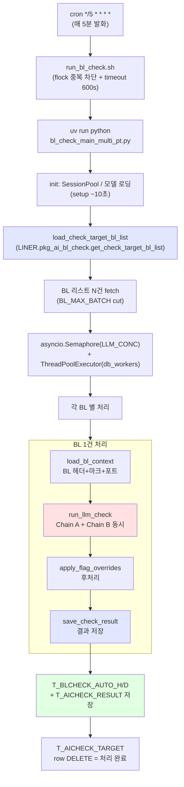
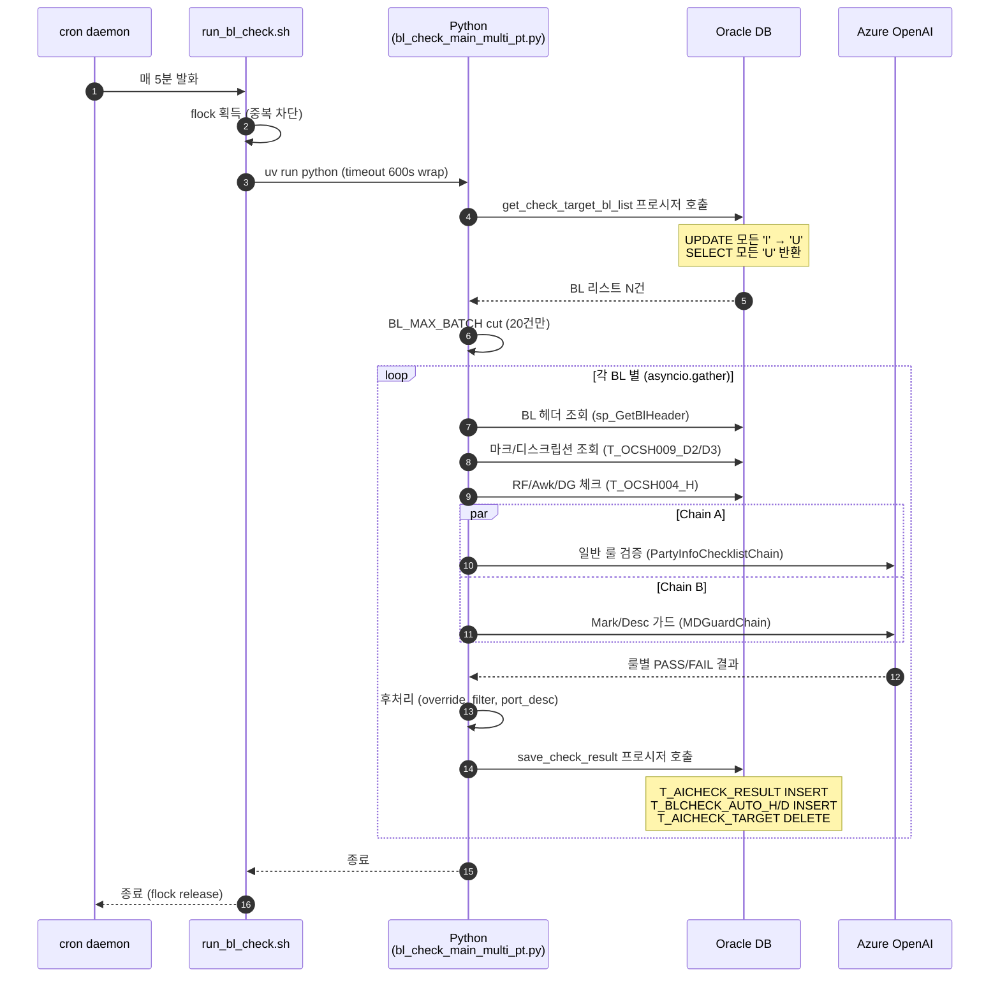
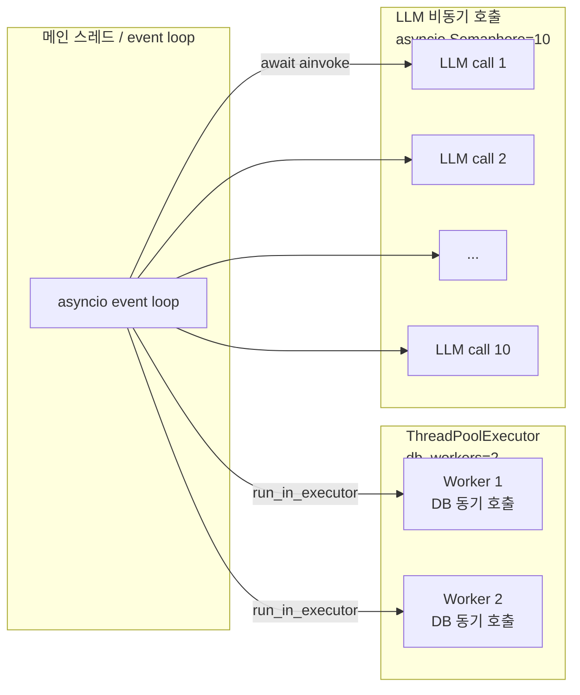

# 아키텍처 개요

코드베이스 기준으로 시스템이 어떻게 구성되어 있는지 설명합니다.

## 한눈에 보는 구조



## 기술 스택

| 레이어 | 기술 | 비고 |
|---|---|---|
| **언어/런타임** | Python 3.11 | uv 로 가상환경 관리 |
| **비동기** | asyncio + ThreadPoolExecutor | LLM 호출 (async) + DB 호출 (thread pool) |
| **LLM 클라이언트** | LangChain (`ChatOpenAI` / `ChatAnthropic` / `ChatGoogleGenerativeAI`) | 현재 사용: Azure OpenAI gpt-5.4-mini |
| **Oracle 클라이언트** | `python-oracledb` (4.0.x) | thin mode 사용 (instantclient 불필요) |
| **cron 스케줄링** | crontab + flock + GNU timeout | 5분 주기, 중복 실행 차단, 600초 hard kill |
| **DB** | Oracle 19c+ | LINER 계정, 192.168.1.3:9889/skr |
| **테이블 / 프로시저** | `pkg_ai_bl_check` 패키지 + `T_AICHECK_*` / `T_BLCHECK_AUTO_*` 테이블 | [데이터 모델](data-model.md) 참고 |

## 디렉터리 구조

```
bl_check_management_arrange - final_kr/
├── bl_check_main_multi_pt.py        # ★ 메인 진입점 (asyncio 오케스트레이션)
├── run_bl_check.sh                  # cron 진입 스크립트
├── cx_Oracle.py                     # python-oracledb 의 cx_Oracle 호환 shim
│
├── database_management/
│   └── database_handler.py          # ★ DB 호출 함수 (procedure / select / insert)
│
├── oracle_db/
│   └── oracle_store.py              # ★ DatabaseManager (SessionPool + ora_procedure_call*)
│
├── LLM_extractor/                   # LLM 체인 정의
│   ├── entity_check_chain_gemini.py # PartyInfoChecklistChain (Chain A — 메인)
│   └── md_guard_chain.py            # MDGuardChain (Chain B — Mark/Description 가드)
│
├── pycomms_toolkit/                 # 공통 유틸 (사내 라이브러리)
│   ├── rules.py                     # 룰 처리 (flatten, override, etc.)
│   ├── utils.py                     # ConfigManager, 텍스트 정제
│   └── ...
│
├── configs/                         # 설정 파일
│   ├── gptConfig.ini                # Azure OpenAI key (현재 사용)
│   ├── openAIConfig.ini             # 공식 OpenAI key (미사용)
│   ├── geminiConfig_smno.ini        # Gemini key
│   ├── rules_kr.json                # 룰 한국어 설명 (DB rules 와 병행)
│   ├── credential.yaml              # 자격증명
│   └── path.ini                     # 경로 설정
│
├── logs/                            # 일자별 cron 로그 (logrotate)
│   └── bl_check_YYYY-MM-DD.log
│
├── output/                          # debug dump (사이클 별 디렉토리)
│   └── runYYYYMMDD_HHMM/
│       └── debug_result_<blno>.json
│
└── sql/                             # 운영 SQL 패치 (DB 프로시저 변경 이력)
    └── *.sql
```

## 실행 흐름 (cron 1 사이클)



## 동시성 모델



| 구성 요소 | 동시 수 | 환경변수 |
|---|---|---|
| BL 1사이클당 처리 | 20건 | `BL_MAX_BATCH` |
| BL 처리 batch 크기 | 10건 (asyncio.gather) | `--batch_size` |
| 동시 LLM 호출 | 10개 | `--llm_concurrency` / `LLM_CONC` |
| DB ThreadPool | 2개 | `--db_workers` / `DB_WORKERS` |

## 모듈 책임

자세한 사항은 모듈별 문서 참고:

- [`bl_check_main_multi_pt.py`](modules/main.md) — 메인 오케스트레이션
- [`database_handler.py`](modules/database-handler.md) — DB 호출 함수
- [`oracle_store.py`](modules/oracle-store.md) — Oracle SessionPool / 프로시저 호출
- [`LLM_extractor/`](modules/llm-extractor.md) — LLM 체인
- DB 프로시저 ([`pkg_ai_bl_check`](modules/procedures.md))
