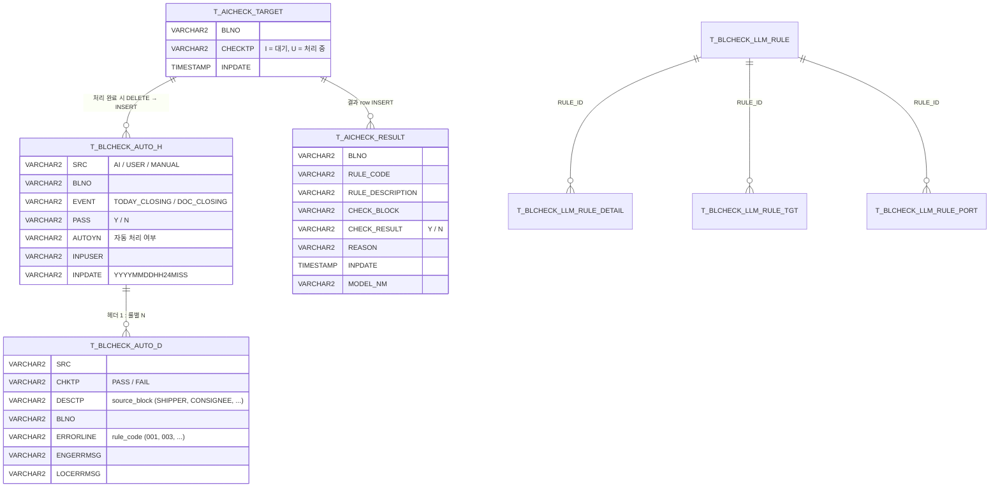
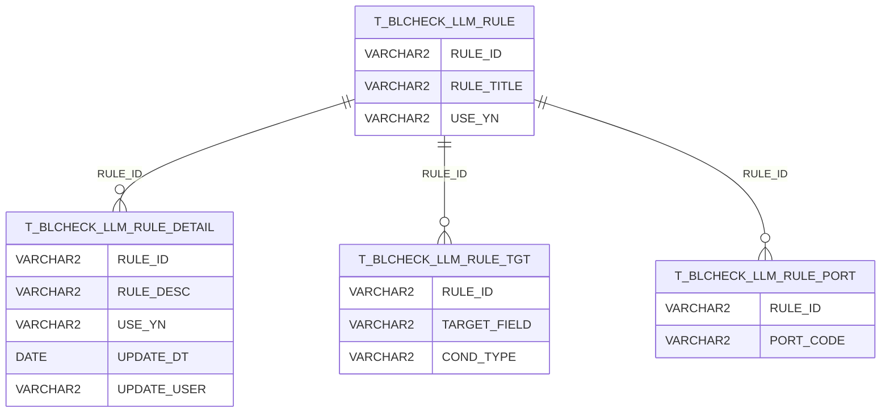
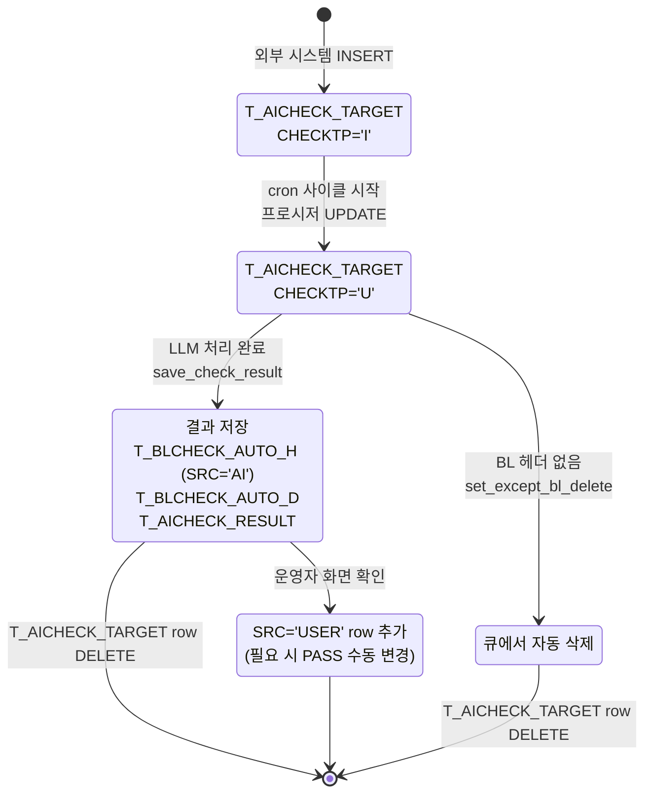

# 데이터 모델

BL Check 시스템이 사용하는 Oracle DB 테이블과 프로시저를 정리합니다.

## 한눈에 보는 ER



## 1) 우리 시스템이 직접 만든 테이블

### `T_AICHECK_TARGET` — AI 체크 큐

신규 BL 이 입력되면 외부 시스템이 이 테이블에 row 를 INSERT 합니다. cron 사이클이 이 큐를 폴링합니다.

| 컬럼 | 타입 | 의미 |
|---|---|---|
| `BLNO` | VARCHAR2 | BL 번호 (예: `SNKO010260504188`) |
| `CHECKTP` | VARCHAR2(1) | `'I'` = 대기 (Initial), `'U'` = 처리 중 (Updated) |
| `INPDATE` | TIMESTAMP | 큐 적재 시각 |

**라이프사이클:**
1. INSERT (외부 시스템) → `CHECKTP='I'`
2. cron 사이클 시작 → 프로시저가 `'I' → 'U'`
3. 처리 완료 → row 자체 DELETE

### `T_AICHECK_RESULT` — AI 룰별 결과

LLM 이 판정한 룰별 결과의 백엔드 저장소.

| 컬럼 | 타입 | 의미 |
|---|---|---|
| `BLNO` | VARCHAR2 | BL 번호 |
| `RULE_CODE` | VARCHAR2 | 룰 코드 (`001`, `003`, `007`, `9999` 등) |
| `RULE_DESCRIPTION` | VARCHAR2 | 룰 설명 (한국어/영어) |
| `CHECK_BLOCK` | VARCHAR2 | 적용 블록 (SHIPPER, CONSIGNEE, NOTIFY, MARK_AND_DESC 등) |
| `CHECK_RESULT` | VARCHAR2(1) | `'Y'` = PASS, `'N'` = FAIL |
| `REASON` | VARCHAR2 | LLM 판정 근거 (한국어) |
| `INPDATE` | TIMESTAMP | 결과 저장 시각 |
| `MODEL_NM` | VARCHAR2 | 사용 모델명 (`gpt-5.4-mini` 등) |

### `T_BLCHECK_AUTO_H` — BL 체크 결과 헤더 (AI + 휴먼 통합)

운영 화면에서 보여주는 BL 전체 PASS/FAIL 결과. **AI 와 휴먼 결과를 SRC 컬럼으로 구분하여 같은 테이블에 저장.**

| 컬럼 | 타입 | 의미 |
|---|---|---|
| `SRC` | VARCHAR2 | `'AI'` (LLM 자동), `'USER'`/`'MANUAL'` (휴먼) |
| `BLNO` | VARCHAR2 | BL 번호 |
| `EVENT` | VARCHAR2 | 이벤트 (`TODAY_CLOSING`, `DOC_CLOSING` 등) |
| `PASS` | VARCHAR2(1) | `'Y'` = 전체 PASS, `'N'` = 실패 있음 |
| `AUTOYN` | VARCHAR2(1) | 자동 처리 여부 |
| `INPUSER` | VARCHAR2 | 입력자 (`ADMIN`, 운영자 ID 등) |
| `INPDATE` | VARCHAR2 | `'YYYYMMDDHH24MISS'` 문자열 |

### `T_BLCHECK_AUTO_D` — BL 체크 결과 상세 (룰별)

`T_BLCHECK_AUTO_H` 의 자식 테이블. 룰별 PASS/FAIL 상세.

| 컬럼 | 타입 | 의미 |
|---|---|---|
| `SRC` | VARCHAR2 | `'AI'` / 휴먼 SRC |
| `CHKTP` | VARCHAR2 | `'PASS'` / `'FAIL'` |
| `DESCTP` | VARCHAR2 | `source_block` (SHIPPER, CONSIGNEE, NOTIFY 등) |
| `BLNO` | VARCHAR2 | BL 번호 |
| `ERRORLINE` | VARCHAR2 | 룰 코드 (`001`, `007` 등) |
| `ENGERRMSG` | VARCHAR2 | LLM 판정 근거 (영문/한국어) |
| `LOCERRMSG` | VARCHAR2 | 위와 동일 (필요시 다국어 분리) |
| `CUSTSENDYN` | VARCHAR2 | 고객 발송 여부 |
| `EMPSENDYN` | VARCHAR2 | 직원 발송 여부 |

### 기타 부속 테이블

| 테이블 | 용도 |
|---|---|
| `T_AICHECK_LOG` | AI 처리 로그 (성공/에러 메시지) |
| `TMP_TARGET_BL` | Global Temporary Table (세션 단위 임시 BL 리스트) |
| `TMP_ERRINFO` | Global Temporary Table (에러 정보 임시 저장) |

## 2) 룰 정의 테이블 (룰 관리)

룰 자체의 정의 (제목, 본문, 적용 대상, 적용 포트) 를 분리하여 저장.



- **`TARGET_FIELD`**: SHIPPER / CONSIGNEE / NOTIFY / MARK_AND_DESC / DG_MARK_AND_DESC / RF_MARK_AND_DESC
- **`COND_TYPE`**: N (공통) / T (TO ORDER 제외) / F (SAME AS 제외) / D (DG) / R (REEFER) / O (AWKWARD) / I (INLAND)
- **`PORT_CODE`**: 항만 코드 (`KRPUS`, `INCCU`, `CNSHA` 등) 또는 `ALL` (전체)

## 3) BL 원본 데이터 (BL 마스터 / 부속 정보)

BL 의 헤더, 마크, 디스크립션, 특수 화물 정보 등은 별도 마스터 테이블에서 가져옵니다.

| 테이블 / 프로시저 | 용도 | 코드 호출 함수 |
|---|---|---|
| `SHMS_PKG_CA.sp_GetBlHeader` (프로시저) | BL 헤더 (POL/POD, 송하인/수하인/통지처) | `call_sp_get_bl_header` |
| `T_OCSH009_D2` | BL 마크 정보 (`HMSEQ`, `HMMARKS`) | `get_mark_desc_by_blno` |
| `T_OCSH009_D3` | BL 디스크립션 (`HDSEQ`, `HDDESC`) | `get_mark_desc_by_blno` |
| `T_OCSH001_H` | CNSHA 체크 (`BK_NO`, `DIS_CD`, `ORG_CD`, `INLAND_POR`, `DLV_CD`) | `get_cnsha_check` |
| `T_OCSH004_H` | RF/Awkward/DG 화물 체크 | `get_rf_awk_dg_check` |
| `T_OCSH009_H` | MF Type (Custom Manifest C/S) | `get_mftype_cs_check` |
| `GROUPWARE_EDM_ERP` | EDM 그룹웨어 (RD 문서 존재 체크) | `get_rd_yn_check` |
| `T_DAEMON_EDM` | 데몬 EDM 정보 | `get_rd_yn_check` |
| `MARKS` | 마크 코드 마스터 (참조) | (간접) |
| `SKR_DOC_MST` | 문서 마스터 (DOC_TYPE) | (간접) |
| `SHMS_PKG_AFR.sf_GetAFRInfo` | AFR (Advance Filing Rules) 정보 | (간접) |

## 4) 호출하는 DB 프로시저

| 프로시저 | 용도 |
|---|---|
| `LINER.pkg_ai_bl_check.get_check_target_bl_list` | 큐에서 BL 리스트 가져오기 |
| `LINER.pkg_ai_bl_check.set_except_bl_delete` | 처리 대상 아닌 BL 큐 삭제 |
| `LINER.pkg_ai_bl_check.get_check_rule_by_port` | 포트 별 룰 조회 |
| `LINER.pkg_ai_bl_check.save_check_result` | AI 체크 결과 저장 |
| `LINER.SHMS_PKG_CA.sp_GetBlHeader` | BL 헤더 조회 |
| `LINER.SHMS_PKG_AFR.sf_GetAFRInfo` | AFR 정보 조회 |
| `LINER.SHMS_PKG_AFR.sf_GetTelNo` | AFR 전화번호 조회 |
| `LINER.SHMS_PKG_AFR.sf_GetPIC` | AFR 담당자 조회 |
| `LINER.SHMS_PKG_AFR.sf_GetPICTEL` | AFR 담당자 전화 |
| `LINER.SHMS_PKG_AFR.sf_GetAFRNacd` | AFR NACD 조회 |

자세한 프로시저 본문은 [DB 프로시저 모듈](modules/procedures.md) 참고.

## 5) BL 상태 라이프사이클



## 6) AI 와 휴먼 결과 분리 패턴

같은 BL 에 대해 `T_BLCHECK_AUTO_H` 에 여러 row 가 시간 순으로 누적됩니다.

```sql
-- 한 BL 의 처리 이력
SELECT BLNO, SRC, EVENT, PASS, INPUSER, INPDATE
FROM LINER.T_BLCHECK_AUTO_H
WHERE BLNO = 'SNKO010260504188'
ORDER BY INPDATE
```

결과 예시:

| BLNO | SRC | EVENT | PASS | INPUSER | INPDATE |
|---|---|---|---|---|---|
| SNKO... | AI | TODAY_CLOSING | N | ADMIN | 20260518101530 |
| SNKO... | USER | TODAY_CLOSING | Y | 윤승현 | 20260520121045 |

→ AI 가 FAIL 한 결과를 휴먼이 PASS 로 뒤집은 케이스. 분석 시 SRC + INPDATE 정렬로 비교 가능.
