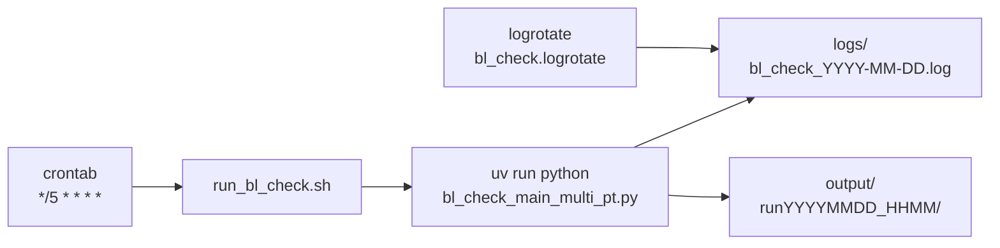

# 배포 및 운영 환경

cron 등록 / 환경변수 / 디렉토리 구조 등 배포 측면을 정리합니다.

## 한눈에 보는 배포



## cron 등록

### 현재 등록된 crontab

```bash
crontab -l
```

```
*/5 * * * * "/home/dev01/seunghyun/project/고객지원팀/bl_check_management_arrange - final_kr/run_bl_check.sh" >> /tmp/bl_check_cron.log 2>&1
```

→ 매 5분 (0, 5, 10, ..., 55분) 마다 발화.

### crontab 백업 / 복구

```bash
# 백업
crontab -l > /tmp/crontab.bak.$(date +%Y%m%d_%H%M)

# 복구
crontab /tmp/crontab.bak.20260519_1445

# 임시 중단
crontab -r
```

→ 백업 파일은 `/tmp/crontab.bak.*` 에 보존. 새벽 작업 등 임시 중단 시 활용.

## run_bl_check.sh — 진입 스크립트

[run_bl_check.sh](../run_bl_check.sh)

```bash
#!/usr/bin/env bash
set -euo pipefail

PROJECT_DIR="/home/dev01/seunghyun/project/고객지원팀/bl_check_management_arrange - final_kr"
LOCK_FILE="/tmp/bl_check.lock"
LOG_DIR="${PROJECT_DIR}/logs"
LOG_FILE="${LOG_DIR}/bl_check_$(date +%Y-%m-%d).log"

# 실행 파라미터
MODEL="${MODEL:-gpt-5.4-mini}"
LLM_CONC="${LLM_CONC:-10}"
DB_WORKERS="${DB_WORKERS:-2}"
BATCH_SIZE="${BATCH_SIZE:-10}"
export BL_MAX_BATCH="${BL_MAX_BATCH:-20}"

# DB 자격증명 (운영 환경)
DB_USER="${DB_USER:-liner}"
DB_PWD="${DB_PWD:-***}"
DB_DSN="${DB_DSN:-192.168.1.3:9889/skr}"

# flock 중복 실행 차단
exec 9>"${LOCK_FILE}"
flock -n 9 || { echo "[SKIP] 이미 실행 중"; exit 0; }

# 토큰 추적 + 사이클 식별자
export BL_TOKEN_LOG=1
export BL_RUN_IDX="$(date +%Y%m%d_%H%M)"

# 600초 hard timeout 으로 wrap
timeout --kill-after=30s 600s \
  uv run python bl_check_main_multi_pt.py \
    --model "${MODEL}" \
    --llm_concurrency "${LLM_CONC}" \
    --db_workers "${DB_WORKERS}" \
    --batch_size "${BATCH_SIZE}" \
    ...
```

### 환경변수 우선순위

`run_bl_check.sh` 의 환경변수는 `${VAR:-default}` 패턴이라 외부에서 override 가능:

```bash
# 일회성 호출 (3건만 처리)
BL_MAX_BATCH=3 bash run_bl_check.sh

# LLM 동시 호출 늘리기 (테스트)
LLM_CONC=20 bash run_bl_check.sh

# 특정 BL 리스트만 처리 (큐 대신 파일 사용)
BL_LIST_FILE=/tmp/my_bls.txt bash run_bl_check.sh
```

## 환경변수 전체 목록

### 실행 파라미터

| 환경변수 | 기본값 | 의미 |
|---|---|---|
| `MODEL` | `gpt-5.4-mini` | 사용할 LLM 모델 |
| `LLM_CONC` | `10` | 동시 LLM 호출 수 (asyncio Semaphore) |
| `DB_WORKERS` | `2` | DB ThreadPoolExecutor 워커 수 |
| `BATCH_SIZE` | `10` | asyncio.gather batch 크기 |
| `BL_MAX_BATCH` | `20` | 한 cron 사이클당 최대 BL 수 |

### DB 자격증명

| 환경변수 | 기본값 | 의미 |
|---|---|---|
| `DB_USER` | `liner` | Oracle 사용자 |
| `DB_PWD` | (하드코딩 — 보안 이슈) | Oracle 비밀번호 |
| `DB_DSN` | `192.168.1.3:9889/skr` | Oracle DSN |

### Debug / 운영

| 환경변수 | 기본값 | 의미 |
|---|---|---|
| `BL_TOKEN_LOG` | `1` (스크립트가 자동 set) | 토큰 사용량 추적 활성화 |
| `BL_RUN_IDX` | (cron 발화 시각) | 사이클 식별자, output 디렉토리명 |
| `BL_LIST_FILE` | 미설정 | 외부 BL 리스트 파일 (큐 대신) |
| `BL_USE_HYBRID` | `1` | Chain A + Chain B Hybrid 모드 |
| `BL_PER_TIMEOUT` | `300` | BL 1건당 timeout (초) |
| `BL_DUMP_INPUT` | 미설정 | 특정 BL 의 LLM 입력 텍스트 저장 |
| `BL_DUMP_RAW` | 미설정 | sanitize 전/후 raw payload 저장 |

## 로그 관리

### 로그 파일

```
logs/
├── bl_check_2026-05-19.log         # 일자별 로그
├── bl_check_2026-05-20.log
└── bl_check_YYYY-MM-DD.log
```

매 cron 사이클의 stdout/stderr 가 일자별로 append.

### logrotate 설정

[`bl_check.logrotate`](../bl_check.logrotate)

```
/.../logs/bl_check_*.log {
    daily
    rotate 30
    compress
    missingok
    notifempty
    copytruncate
}
```

→ 30일치 보관. 매일 자동 rotate.

### 실시간 로그 보기

```bash
# 실시간 (Ctrl+C 종료)
tail -f "/home/dev01/seunghyun/project/고객지원팀/bl_check_management_arrange - final_kr/logs/bl_check_$(date +%Y-%m-%d).log"

# 핵심만 필터링
tail -f ".../logs/bl_check_$(date +%Y-%m-%d).log" | grep -E "START|END|완료:|FAIL|DPY-"

# 최근 50줄
tail -50 ".../logs/bl_check_$(date +%Y-%m-%d).log"
```

## output 디렉토리 (debug dump)

```
output/
├── runYYYYMMDD_HHMM/                       # 사이클 별 디렉토리
│   ├── debug_result_<blno>.json            # LLM 결과 dump
│   └── debug_result_<blno>.json
├── runYYYYMMDD_HHMM_token_usage.json       # 토큰 사용량
└── llm_input_<blno>.txt                    # BL_DUMP_INPUT 시 LLM 입력 dump
```

⚠ **누적 위험**: output/run* 디렉토리가 영구 누적됨. 정기 정리 권장:

```bash
# 7일 이상 된 디렉토리 자동 삭제 (cron 추가 권장)
0 3 * * * find ".../output/" -maxdepth 1 -name "run*" -type d -mtime +7 -exec rm -rf {} \;
```

## 디스크 사용량 점검

```bash
df -h /home/dev01                # 디스크 전체
du -sh ".../bl_check.../"        # 프로젝트 크기
du -sh ".../output/"             # output 크기
ls ".../output/run*" | wc -l     # output 디렉토리 수
```

## 프로세스 관리

### 실행 중 cron 사이클 확인

```bash
ps -ef | grep bl_check_main | grep -v grep
```

→ `timeout 600s uv run python ...` 가 보이면 사이클 진행 중.

### 강제 종료 (긴급 시)

```bash
pkill -9 -f bl_check_main_multi_pt
rm -f /tmp/bl_check.lock
```

⚠ 주의: 강제 종료 시 DB 측에 좀비 세션이 생길 수 있음 ([트러블슈팅](../operations/troubleshooting.md) 참고).

## 의존성 관리 (uv)

### 의존성 추가 / 변경

```bash
cd ".../bl_check_management_arrange - final_kr"

# 패키지 추가
uv add somepackage

# 의존성 동기화
uv sync

# 가상환경 재생성
rm -rf .venv && uv sync
```

### Python 버전

`.python-version` 또는 `pyproject.toml` 에서 관리. 현재 3.11.

## DB 비밀번호 보안 (개선 권장)

⚠ 현재 비밀번호가 코드 13곳에 하드코딩되어 있음. 향후 개선:

```python
# 기존 (database_handler.py 13곳)
password="SinokorMan0823"

# 권장
password=os.environ["DB_PWD"]
```

`.env` 파일 + `.gitignore` + systemd EnvironmentFile 활용.
