# database_management/database_handler.py — DB 호출 함수

BL Check 와 관련된 모든 DB 호출 (procedure / select / insert) 을 모아둔 모듈.

## 한눈에 보는 함수 분류

```mermaid
flowchart TD
    A[database_handler.py] --> B[BL 정보 조회]
    A --> C[큐 / 결과 저장]
    A --> D[특수 화물 체크]
    A --> E[기타 EDM/AFR]

    B --> B1["call_sp_get_bl_header<br/>BL 헤더 (sp_GetBlHeader)"]
    B --> B2["get_mark_desc_by_blno<br/>마크 + 디스크립션"]
    B --> B3["get_port_check_details<br/>포트 별 룰"]
    B --> B4["target_blno<br/>큐 대상 BL"]

    C --> C1["load_check_target_bl_list<br/>큐에서 BL 리스트"]
    C --> C2["load_ingest_req<br/>save_check_result 호출"]
    C --> C3["set_except_bl_delete<br/>큐에서 제외"]
    C --> C4["replace_rule_with_port_desc<br/>룰 텍스트 치환"]

    D --> D1["get_cnsha_check<br/>중국 상하이"]
    D --> D2["get_rf_awk_dg_check<br/>RF/Awk/DG"]
    D --> D3["get_mftype_cs_check<br/>Manifest C/S"]
    D --> D4["get_rd_yn_check<br/>EDM RD 문서"]

    E --> E1["get_afr_info_by_blno<br/>AFR 정보"]
    E --> E2["get_hscode_jp_by_blno<br/>HS 코드 (일본)"]
```



## 함수 레퍼런스

### 큐 / 결과 저장 (핵심)

#### `load_check_target_bl_list(user_name, limit=None)`

[L870](../../../database_management/database_handler.py#L870)

큐에서 처리 대상 BL 리스트를 가져옴 (`LINER.pkg_ai_bl_check.get_check_target_bl_list` 호출).

```python
target_list = load_check_target_bl_list("liner", limit=15)  # limit 지원 시
# target_list = load_check_target_bl_list("liner")           # 전체 (현재 운영)

# 반환 구조:
# {
#   "status_code": "SUCCESS",
#   "bl_list":     pd.DataFrame[BLNO],
#   "errors":      pd.DataFrame[error_code, error_message],
# }
```

**프로시저 호출 (`ora_procedure_call5`):**
- IN: `pi_limit` (옵션, NULL 이면 전체)
- OUT: `po_bl_list` (REFCURSOR), `po_status_code` (VARCHAR2), `po_errors` (REFCURSOR)

`pi_limit` 미사용 시 fallback (현재 프로시저는 pi_limit 없음).

#### `load_ingest_req(sq_data_dict, user_name)`

[L777](../../../database_management/database_handler.py#L777)

AI 체크 결과를 DB 에 저장 (`LINER.pkg_ai_bl_check.save_check_result` 호출 wrapping).

```python
ingest_dict = {
    "pi_task_code": "BL_CKECK_RESULT",
    "pi_payload":   json.dumps(result, ensure_ascii=False)
}
status = load_ingest_req(ingest_dict, "liner")
# → 'SUCCESS' / 'ERROR'
```

#### `set_except_bl_delete(user_name, blno)`

[L752](../../../database_management/database_handler.py#L752)

처리 대상 아닌 BL 을 큐에서 제외 (`pkg_ai_bl_check.set_except_bl_delete` 호출).

```python
set_except_bl_delete("liner", "SNKO010260504188")
# T_AICHECK_TARGET 에서 row DELETE
# T_AICHECK_LOG 에 "처리 대상 BL이 아님" 기록
```

#### `target_blno(user)`

[L146](../../../database_management/database_handler.py#L146) — `load_check_target_bl_list` 와 유사. 일부 환경에서 사용.

### BL 정보 조회

#### `call_sp_get_bl_header(user, param)`

[L1756](../../../database_management/database_handler.py#L1756)

BL 헤더 조회 (`LINER.SHMS_PKG_CA.sp_GetBlHeader` 프로시저 호출).

```python
bl_info_dict = {"blno": "SNKO...", "userid": "430012", "agtcd": "HQR"}
df = call_sp_get_bl_header("liner", bl_info_dict)
# → pd.DataFrame[HHDISCCD, HHFDNM, HHDLVNM, SHIPPER_NAME, CONSIGNEE_NAME, NOTIFY_NAME, CAPOL_META, CAPOD_META, ...]
```

핵심 컬럼 (`REQUIRED_HEADER_COLS` — 누락 시 `BlHeaderDeleteTargetError`):
- `HHDISCCD` — POD (Port of Discharge)
- `HHFDNM` — Final Destination Name
- `HHDLVNM` — Delivery Name
- `SHIPPER_NAME` / `SHIPPER_ADDR`
- `CONSIGNEE_NAME` / `CONSIGNEE_ADDR`
- `NOTIFY_NAME` / `NOTIFY_ADDR`
- `CAPOL_META` — POL code (2자리)
- `CAPOD_META` — POD code (2자리)

#### `get_mark_desc_by_blno(blno, user)`

[L291](../../../database_management/database_handler.py#L291)

BL 마크 + 디스크립션 조회.

```python
df = get_mark_desc_by_blno("SNKO...", "liner")
# → pd.DataFrame[SEQ, MARK, DESCR]
```

**SQL (UNION):**
```sql
SELECT ROW_NUMBER() OVER (ORDER BY HMSEQ) AS SEQ, HMMARKS AS MARK
  FROM LINER.T_OCSH009_D2
 WHERE HMBLNO = :blno
UNION ALL
SELECT ROW_NUMBER() OVER (ORDER BY HDSEQ) AS SEQ, HDDESC AS DESCR
  FROM LINER.T_OCSH009_D3
 WHERE HDBLNO = :blno
```

#### `get_port_check_details(db_manager, port_code)`

[L343](../../../database_management/database_handler.py#L343)

포트 별로 적용할 룰 조회 (T_BLCHECK_LLM_RULE 4개 테이블 JOIN).

```python
df = get_port_check_details(db_manager, "KRPUS")
# → pd.DataFrame[CODE_NO (RULE_ID), PORT_DESC (TITLE), PORT_DESC_DETAIL (DESC), TARGET_DESC, DELIVERY_TYPE_YN, ...]
```

### 특수 화물 체크

#### `get_cnsha_check(blno, user)`

[L437](../../../database_management/database_handler.py#L437)

POD 가 CNSHA (중국 상하이) 인 경우만 호출. `T_OCSH001_H` 조회.

```python
df = get_cnsha_check("SNKO...", "liner")
# → pd.DataFrame[BK_NO, DIS_CD, ORG_CD, INLAND_POR, DLV_CD, INLAND]
# → empty 면 'N', 아니면 'I' (Inland 적용)
```

#### `get_rf_awk_dg_check(blno, user)`

[L483](../../../database_management/database_handler.py#L483)

RF (Reefer / 냉동) / Awkward / DG (Dangerous Goods) 화물 체크.

```python
df = get_rf_awk_dg_check("SNKO...", "liner")
# → pd.DataFrame[HHBLNO, HHMITEM, RF_YN, AWK_YN, DG_YN]
```

조회 테이블: `T_OCSH004_H` (RF), `T_OCSH009_H` (heading)

#### `get_mftype_cs_check(blno, user)`

[L541](../../../database_management/database_handler.py#L541)

Manifest Type (C: Consolidate / S: Simple) 체크. `T_OCSH009_H` 조회.

```python
df = get_mftype_cs_check("SNKO...", "liner")
# → pd.DataFrame[HHBLNO, HHMFTYPE]
```

rule 9999 (SHIPPER OF INSTRUCTION) 결정 시 사용.

#### `get_rd_yn_check(blno, user)`

[L591](../../../database_management/database_handler.py#L591)

EDM RD (Release Document) 문서가 존재하는지 체크.

```python
yn = get_rd_yn_check("SNKO...", "liner")
# → 'Y' (RD 문서 존재) / 'N' (없음)
```

조회 테이블:
- `SKR_DOC_MST` (문서 마스터)
- `LINER.GROUPWARE_EDM_ERP` (그룹웨어 EDM)
- `LINER.T_DAEMON_EDM` (데몬 EDM)

→ 'Y' 이면 rule 008 (EDM 관련 룰) 자동 통과 처리.

### 기타

#### `replace_rule_with_port_desc(db_manager, result, table_name="BL_CHECK_H")`

[L64](../../../database_management/database_handler.py#L64)

LLM 응답의 `rule_code` 를 한국어 설명으로 치환.

```python
result = replace_rule_with_port_desc(db_manager, result)
# rule_code='001' → rule_description="BANK 명칭이 있는 경우..."
```

#### `get_afr_info_by_blno(blno, user)`

[L182](../../../database_management/database_handler.py#L182)

AFR (Advance Filing Rules — 일본/미국 사전 신고) 정보 조회.

`LINER.SHMS_PKG_AFR.sf_GetAFRInfo` 등 함수 호출 → SHIPPER / CONSIGNEE 의 NAME, ADDRESS, TEL, NACD, PIC 등.

#### `get_hscode_jp_by_blno(blno, user)`

[L407](../../../database_management/database_handler.py#L407)

HS 코드 (일본) 조회.

### 데몬 / 로그 / 기타 함수 (BL Check 직접 무관)

이 모듈에는 다른 시스템 (인사, 송금, 운임 등) 함수도 함께 있음:

| 함수 | 라인 | 비고 |
|---|---|---|
| `load_sq_data` | [L943](../../../database_management/database_handler.py#L943) | (다른 용도) |
| `save_data_automation` | [L1001](../../../database_management/database_handler.py#L1001) | (다른 용도) |
| `save_hrci_data` | [L1072](../../../database_management/database_handler.py#L1072) | 인사 데이터 |
| `save_bunker_price` | [L1145](../../../database_management/database_handler.py#L1145) | 벙커유 가격 |
| `daemon_log` | [L1237](../../../database_management/database_handler.py#L1237) | 데몬 로그 |
| `GetCheckEdmExists` / `Set_CertData` / `Get_Certifile` | [L1294~](../../../database_management/database_handler.py#L1294) | 인증서 / EDM |
| `get_mail_receiver` | [L1439](../../../database_management/database_handler.py#L1439) | 메일 수신자 |
| `load_remit_edm_data` / `update_remit_transno` | [L1508~](../../../database_management/database_handler.py#L1508) | 송금 EDM |
| `find_similar_user_from_oracle` | [L1649](../../../database_management/database_handler.py#L1649) | 사용자 검색 |
| `call_sp_dpcopayinfo` | [L1708](../../../database_management/database_handler.py#L1708) | 정산 정보 |

→ BL Check 직접 관련 X. 다른 데몬 / 시스템이 같은 파일 공유 중.

## DB 커넥션 관리

거의 모든 함수가 자체적으로 `DatabaseManager` 인스턴스를 생성:

```python
db_manager = DatabaseManager(
    user="liner",
    password="SinokorMan0823",   # ⚠ 하드코딩 (개선 권장)
    dsn=cx_Oracle.makedsn("192.168.1.3", 9889, service_name="skr"),
)
```

⚠ **비밀번호 13곳 하드코딩 — 보안 개선 필요.** ([배포 / 환경변수](../deployment.md) 참고)

→ 향후 환경변수 또는 ConfigManager 로 단일화 권장.

## 관련 문서

- [bl_check_main_multi_pt.py](main.md)
- [oracle_store.py](oracle-store.md)
- [DB 프로시저](procedures.md)
- [데이터 모델](../data-model.md)
