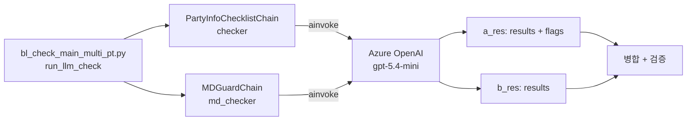

# LLM_extractor/ — LLM 체인

LangChain 기반 LLM 체인 패키지. Chain A (일반 룰) + Chain B (Mark/Description Guard).

## 디렉터리 구조

```
LLM_extractor/
├── __init__.py
├── base_chain.py                    # 공통 베이스 클래스
├── entity_check_chain_gemini.py     # PartyInfoChecklistChain (Chain A)
└── md_guard_chain.py                # MDGuardChain (Chain B)
```

## 한눈에 보는 호출



## 1) `PartyInfoChecklistChain` (Chain A — 일반 룰)

[LLM_extractor/entity_check_chain_gemini.py](../../../LLM_extractor/entity_check_chain_gemini.py)

### 역할

일반 룰 (SHIPPER / CONSIGNEE / NOTIFY / DG / RF / awkward / inland 등) 의 PASS/FAIL 판정.

### 호출 인터페이스

```python
from LLM_extractor.entity_check_chain_gemini import PartyInfoChecklistChain

checker = PartyInfoChecklistChain(
    gpt=gpt_model,                  # LangChain ChatModel
    model_provider={"model": "gpt-5.4-mini"},
)

result = await checker.chain.ainvoke({
    "input_text": "...BL 텍스트...",
    "tasks_compact_json": "...",      # 룰 태스크 (compact)
    "rule_definitions_json": "...",   # 룰 본문 정의
}, config={"callbacks": [_TOKEN_TRACKER]})
```

### 입력 변수

| 변수 | 형식 | 내용 |
|---|---|---|
| `input_text` | str | BL 헤더 + 마크 + 디스크립션 전체 텍스트 (METADATA / SHIPPER / CONSIGNEE / NOTIFY / MARK / DESCRIPTION / MAIN_ITEM 섹션) |
| `tasks_compact_json` | JSON str | 적용할 룰 태스크 (블록별로) |
| `rule_definitions_json` | JSON str | 룰 본문 정의 (중복 제거된 마스터) |

### 출력 구조

```python
{
    "results": [
        {
            "rule_code":    "001",
            "rule":         "BANK 명칭이...",
            "status":       True,        # PASS
            "reason":       "BANK 정보 없음, 정상",
            "source_block": "SHIPPER",
        },
        ...
    ],
    "flags": {
        "CONSIGNEE_IS_ORDER_INSTRUCTION":  False,
        "NOTIFY_IS_SAME_AS_CONSIGNEE":     False,
        "SHIPPER_OF_INSTRUCTION":          False,
    },
}
```

### `flags` 의 역할

LLM 이 BL 전체에서 감지한 패턴. `apply_flag_overrides` ([main.py:699](../../../bl_check_main_multi_pt.py#L699)) 에서 후처리에 사용:

```python
if flags["CONSIGNEE_IS_ORDER_INSTRUCTION"]:
    # CONSIGNEE 블록의 룰 결과를 모두 PASS 로 강제 (TO ORDER 케이스)
    for row in results:
        if row.get("source_block") == "CONSIGNEE":
            row["status"] = True
            row["reason"] = f"[OVERRIDE: CONSIGNEE_IS_ORDER_INSTRUCTION] {row['reason']}"
```

## 2) `MDGuardChain` (Chain B — Mark/Description Guard)

[LLM_extractor/md_guard_chain.py](../../../LLM_extractor/md_guard_chain.py)

### 역할

MARK 와 DESCRIPTION 블록에 특화된 룰 (예: rule 007 EXIM 코드, rule 034 등) 만 분리하여 처리.

### 분리 이유

Chain A 가 너무 많은 룰을 한 번에 처리하면:
- LLM 응답이 partial / empty 위험 ↑
- MARK/DESC 룰이 무시되기 쉬움

→ 별도 chain 으로 분리하면 결과 안정성 ↑.

### 호출 인터페이스

`PartyInfoChecklistChain` 과 동일:

```python
from LLM_extractor.md_guard_chain import MDGuardChain

md_checker = MDGuardChain(gpt=gpt_model, model_provider=model_provider)

result = await md_checker.chain.ainvoke({
    "input_text": "...",
    "tasks_compact_json": b_tasks_json,
    "rule_definitions_json": b_defs_json,
})
```

### 출력 구조

```python
{
    "results": [
        {
            "rule_code":    "007",
            "rule":         "POD=INCCU & FINAL=NEPAL 이면 EXIM 코드...",
            "status":       False,
            "reason":       "EXIM 코드 미기재",
            "source_block": "MARK_AND_DESC",
        },
        ...
    ],
}
```

→ `flags` 없음 (Chain A 의 flags 만 사용).

## 3) `base_chain.py`

[LLM_extractor/base_chain.py](../../../LLM_extractor/base_chain.py)

공통 베이스. PartyInfoChecklistChain / MDGuardChain 이 상속받는 패턴.

주요:
- LangChain `ChatPromptTemplate` 사용
- JSON 파싱 (응답 dict / list 변환)
- `prompt.format_prompt(...).to_messages()` 패턴

## Chain A + B Hybrid 호출

[bl_check_main_multi_pt.py:587-606](../../../bl_check_main_multi_pt.py#L587):

```python
# 1. 태스크 분리
a_tasks, a_defs, b_tasks, b_defs = split_tasks_for_hybrid(tasks_compact, rule_definitions)
a_tasks_json = json.dumps(a_tasks, ensure_ascii=False, indent=2)
b_tasks_json = json.dumps(b_tasks, ensure_ascii=False, indent=2)

# 2. 두 chain 인스턴스
checker    = PartyInfoChecklistChain(gpt=gpt_model, model_provider=model_provider)
md_checker = MDGuardChain(gpt=gpt_model, model_provider=model_provider)

# 3. 동시 호출 (asyncio.gather)
async def _call_a():
    return await checker.chain.ainvoke({...})

async def _call_b():
    if not b_tasks:
        return {"results": [], "flags": {}}
    return await md_checker.chain.ainvoke({...})

a_res, b_res = await asyncio.gather(_call_a(), _call_b())
```

→ 두 LLM 호출이 동시에 진행. asyncio 의 진정한 병렬화.

### 응답 완전성 검증

[main.py:608-642](../../../bl_check_main_multi_pt.py#L608):

```python
# Chain A
if not isinstance(a_res, dict):
    raise RuntimeError(f"[CHAIN_A_INVALID] 응답이 dict 아님")
if not a_res.get("flags"):
    raise RuntimeError(f"[CHAIN_A_EMPTY_FLAGS] flags 비어있음 — LLM 응답 불완전")
if _expected_a > 0 and len(_a_results) < max(1, _expected_a // 2):
    raise RuntimeError(f"[CHAIN_A_PARTIAL] results=N/expected — 50% 미만")

# Chain B (b_tasks 있을 때만)
if b_tasks:
    if not isinstance(b_res, dict):
        raise RuntimeError(f"[CHAIN_B_INVALID]")
    if _expected_b >= 3 and len(_b_results) == 0:
        raise RuntimeError(f"[CHAIN_B_EMPTY]")
```

→ 검증 실패 시 `RuntimeError` → `ar_retry(retries=3)` 가 자동 재시도.

### 단일 체인 모드

환경변수 `BL_USE_HYBRID=0` 시 Chain A 단일 호출. 디버깅 / 롤백용.

```python
_use_hybrid = os.environ.get("BL_USE_HYBRID", "1") != "0"
if _use_hybrid:
    # Chain A + B
else:
    # Chain A 단일
    result = await checker.chain.ainvoke({...})
```

## 사용하는 LangChain 컴포넌트

| 컴포넌트 | 역할 |
|---|---|
| `ChatOpenAI` / `ChatAnthropic` / `ChatGoogleGenerativeAI` | LLM 클라이언트 |
| `ChatPromptTemplate` | 프롬프트 템플릿 (system + human messages) |
| `BaseCallbackHandler` | 토큰 사용량 추적 (`_TokenUsageTracker`) |
| `chain.ainvoke({...})` | 비동기 호출 (LangChain Runnable 인터페이스) |

## 토큰 사용량 추적

```python
_cfg = {"callbacks": [_TOKEN_TRACKER]} if _TOKEN_TRACKER else {}
result = await checker.chain.ainvoke({...}, config=_cfg)
```

`_TokenUsageTracker.on_llm_end()` ([main.py:73](../../../bl_check_main_multi_pt.py#L73)):
- `input_tokens` / `output_tokens`
- `reasoning_tokens` (output 내 포함, gpt-5.4 의 chain-of-thought)
- `cache_read_tokens` (input 내 포함, Azure OpenAI 의 cache hit)

## 룰 처리 (`pycomms_toolkit/rules.py`)

LLM 입력 / 출력 처리는 `pycomms_toolkit/rules.py` 가 담당:

| 함수 | 역할 |
|---|---|
| `prune_delivery_tree(tree, special)` | RF/AWK/DG 등 적용 안 되는 가지 제거 |
| `flatten_selected_delivery_types(port, tree, allowed)` | 트리 → flat list |
| `prepare_checklist_for_chain(payload)` | 체인 호출용 구조로 변환 |
| `build_tasks_from_rules(rules)` | tasks (expansion 형태) |
| `build_flattened_tasks_and_definitions(rules)` | tasks_compact + rule_definitions (중복 제거) |
| `split_tasks_for_hybrid(tasks_compact, defs)` | Chain A vs Chain B 분리 |
| `align_results_to_tasks(tasks, raw_results)` | 응답을 다시 expansion 형태로 |
| `sanitize_llm_input_text(text)` | 입력 텍스트 정제 |
| `filter_rule_034_by_rule_008(result)` | rule 034 조건부 필터링 |
| `override_rule_018(result, payload)` | rule 018 placeholder 오탐 방지 |
| `override_rule_001_placeholder(result, payload)` | rule 001 placeholder ('ONE LINE', 'TBD' 등) 강제 FAIL |
| `post_process_notify_tax_rules` | NOTIFY tax 후처리 (현재 미사용 — A 옵션 롤백) |
| `override_rule_021_022_notify` | rule 021/022 NOTIFY (현재 미사용 — 회귀 발생) |

## 알려진 제약 / 주의

### Chain A 응답 누락 (`CHAIN_A_EMPTY_FLAGS`)

- LLM 이 가끔 flags 비워서 응답
- → `ar_retry(retries=3)` 가 자동 재시도
- 3회 실패 시 BL 처리 fail

### Chain B 미실행 케이스

- `b_tasks` 가 비어있으면 (해당 포트에 MARK/DESC 룰 없음) Chain B 자동 skip
- `b_res = {"results": [], "flags": {}}` 반환

### `reasoning_effort="low"`

- gpt-5.4 / gpt-5.5 같은 reasoning 모델은 미지정 시 `medium` 기본값 → 매우 느림 (수십 초)
- `low` 로 설정해 속도 ↑ (정확도 약간 ↓)
- gpt-4o / gpt-5o 등 비-reasoning 모델은 무시됨

## 관련 문서

- [AI 파이프라인](../ai-pipeline.md)
- [bl_check_main_multi_pt.py](main.md)
- [룰 정의](../rules.md)
