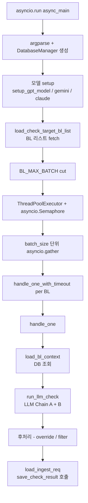

# bl_check_main_multi_pt.py — 메인 오케스트레이션

cron 사이클의 진입점. asyncio + ThreadPoolExecutor 로 BL 병렬 처리.

## 한눈에 보는 구조



## 클래스 / 함수 목록

### 클래스

| 클래스 | 라인 | 역할 |
|---|---|---|
| `_TokenUsageTracker` | [65](../../../bl_check_main_multi_pt.py#L65) | LLM 호출 토큰 사용량 추적 (LangChain BaseCallbackHandler) |
| `BlHeaderDeleteTargetError` | [120](../../../bl_check_main_multi_pt.py#L120) | BL 헤더 없음/필수 컬럼 누락 시 raise → 자동 삭제 대상 |

### 초기화

| 함수 | 라인 | 역할 |
|---|---|---|
| `init_oracle_client_once()` | [109](../../../bl_check_main_multi_pt.py#L109) | oracledb 클라이언트 초기화 (현재 thin mode 라 무동작) |

### 헬퍼 함수 (국가/법인 토큰)

| 함수 | 라인 | 역할 |
|---|---|---|
| `build_allowed_countries_by_cc(cc)` | [180](../../../bl_check_main_multi_pt.py#L180) | 국가코드 → 허용 국가명 리스트 (예: `CN` → `["CHINA", "PRC", "HONG KONG", ...]`) |
| `build_legal_tokens_by_cc(cc)` | [236](../../../bl_check_main_multi_pt.py#L236) | 국가별 법인 토큰 (예: `ID` → `PT`, `CV`, `TBK` 등) |
| `convert_to_delivery_type_tree(df)` | [251](../../../bl_check_main_multi_pt.py#L251) | 룰 DataFrame → DELIVERY_TYPE / TARGET_DESC 중첩 dict |

### 모델 셋업

| 함수 | 라인 | 모델 | 사용 라이브러리 |
|---|---|---|---|
| `setup_gpt_model()` | [271](../../../bl_check_main_multi_pt.py#L271) | gpt-5.4-mini, gpt-5o-* etc. | `langchain_openai.ChatOpenAI` |
| `setup_gemini_model()` | [291](../../../bl_check_main_multi_pt.py#L291) | gemini-1.5-flash, gemini-2.5-* | `langchain_google_genai.ChatGoogleGenerativeAI` |
| `setup_claude_model()` | [311](../../../bl_check_main_multi_pt.py#L311) | claude-sonnet-4 | `langchain_anthropic.ChatAnthropic` |

공통 옵션:
- `temperature=0.0`
- `timeout=60` (HTTP request 레벨)
- `max_retries=2` (자체 재시도)
- gpt-5.4/5.5: `reasoning_effort="low"` (chain-of-thought 깊이 ↓ → 속도 ↑)

### LLM 입력 / 출력 처리

| 함수 | 라인 | 역할 |
|---|---|---|
| `build_extraction_payload_text(general, mark_desc, mitem)` | [325](../../../bl_check_main_multi_pt.py#L325) | BL 헤더 + 마크 + 디스크립션 → LLM 입력 텍스트 (METADATA / SHIPPER / CONSIGNEE / NOTIFY / MARK / DESCRIPTION / MAIN_ITEM 섹션) |
| `load_bl_context(db, blno)` | [441](../../../bl_check_main_multi_pt.py#L441) | DB 호출 모음 (헤더, 마크, 포트룰, 특수화물) — ThreadPoolExecutor 에서 실행 |
| `run_llm_check(gpt_model, model_provider, ctx)` | [496](../../../bl_check_main_multi_pt.py#L496) | LLM Chain A + Chain B 호출 + 결과 병합 |
| `apply_flag_overrides(result)` | [699](../../../bl_check_main_multi_pt.py#L699) | CONSIGNEE_IS_ORDER_INSTRUCTION / NOTIFY_IS_SAME_AS_CONSIGNEE flag 처리 |

### 안전장치

| 함수 | 라인 | 역할 |
|---|---|---|
| `ar_retry(coro_factory, retries=3, backoff=1.5, per_call_timeout=90)` | [732](../../../bl_check_main_multi_pt.py#L732) | LLM 호출 재시도 + asyncio.wait_for 외부 timeout |
| `is_ora24459(e)` | [759](../../../bl_check_main_multi_pt.py#L759) | Oracle ORA-24459 (TAF) 에러 감지 → warmup 후 retry |

### 메인 함수

| 함수 | 라인 | 역할 |
|---|---|---|
| `async_main()` | [765](../../../bl_check_main_multi_pt.py#L765) | 전체 오케스트레이션 (argparse → BL 리스트 → 처리 → 결과 저장) |

## 핵심 데이터 구조

### `BlHeaderDeleteTargetError`

다음 3 조건 중 하나면 raise → `set_except_bl_delete` 로 큐 자동 삭제:

```python
REQUIRED_HEADER_COLS = [
    "HHDISCCD",  # POD (Port of Discharge)
    "HHFDNM", "HHDLVNM",
    "SHIPPER_NAME", "SHIPPER_ADDR",
    "CONSIGNEE_NAME", "CONSIGNEE_ADDR",
    "NOTIFY_NAME", "NOTIFY_ADDR",
    "CAPOL_META", "CAPOD_META",
]
```

| 삭제 조건 | 검출 |
|---|---|
| BL Header 자체 없음 | `general_info_df is None or df.empty` |
| 'blno 결과 조회되지 않음' | 동일 (메시지 통일) |
| 필수 컬럼 누락 | `REQUIRED_HEADER_COLS` 중 없는 컬럼 발견 |

### `CC_TO_COUNTRY` / `CC_TO_LEGAL_TOKENS`

국가코드 (2자리) → 허용 국가명/법인 토큰 매핑.

```python
# 예시
CC_TO_COUNTRY = {
    "CN": ["CHINA", "PRC", "HONG KONG", ...],
    "KR": ["KOREA", "REPUBLIC OF KOREA", ...],
    "JP": ["JAPAN"],
    ...
}

CC_TO_LEGAL_TOKENS = {
    "ID": {"prefix": ["PT", "PT."], "suffix": ["TBK"]},
    "MY": {"prefix": [], "suffix": ["SDN BHD", "BERHAD"]},
    ...
}
```

→ rule 001 (회사명 검증) 평가 시 LLM 에 동적 주입.

### `SECTION_LABELS`

LLM 입력 텍스트의 섹션 구분자.

```python
SECTION_LABELS = {
    "METADATA:",
    "SHIPPER:",
    "CONSIGNEE:",
    "NOTIFY:",
    "MARK:",
    "DESCRIPTION:",
    "MAIN_ITEM:",
}
```

## CLI 인자

```bash
python bl_check_main_multi_pt.py \
    --model gpt-5.4-mini \           # 모델명
    --db_user liner \                 # Oracle 사용자
    --db_pwd ***                      # 비밀번호
    --db_dsn 192.168.1.3:9889/skr \   # DSN
    --llm_concurrency 10 \            # 동시 LLM 호출
    --db_workers 2 \                  # DB ThreadPool
    --batch_size 10                   # asyncio.gather 배치
```

지원 모델 (`choices`):
- `gpt-4o-mini`, `gpt-5o-nano`, `gpt-5o-mini`, `gpt-5`, **`gpt-5.4`, `gpt-5.4-mini`** (운영 기본), `gpt-5.5`
- `gemini-1.5-pro`, `gemini-2.5-flash-lite`, `gemini-2.5-flash`, `gemini-3-flash`
- `claude-sonnet-4-20250514`

## 환경변수 (BL_* prefix)

[배포 / 환경변수](../deployment.md) 참고. 주요:

| 환경변수 | 의미 |
|---|---|
| `BL_MAX_BATCH` | 사이클당 처리 최대 BL 수 (default 100, 운영 20) |
| `BL_PROC_LIMIT` | 프로시저 pi_limit (현재 비활성 — 0 또는 미설정) |
| `BL_USE_HYBRID` | Chain A + Chain B Hybrid 모드 (default 1) |
| `BL_PER_TIMEOUT` | BL 1건당 timeout 초 (default 300) |
| `BL_TOKEN_LOG` | 토큰 사용량 추적 활성화 |
| `BL_RUN_IDX` | 사이클 식별자 (출력 디렉토리명) |
| `BL_LIST_FILE` | 외부 BL 리스트 파일 (DB 큐 대신) |
| `BL_DUMP_INPUT` | 특정 BL 의 LLM 입력 dump |
| `BL_DUMP_RAW` | sanitize 전후 raw payload dump |

## 호출 흐름 (`async_main`)

```python
async def async_main():
    # 1. argparse + 모델 선택
    args = parser.parse_args()
    db_manager = DatabaseManager(args.db_user, args.db_pwd, args.db_dsn)
    gpt_model, model_provider = setup_gpt_model(cfg, args.model)

    # 2. BL 리스트 fetch
    if os.environ.get("BL_LIST_FILE"):
        bl_list = [open(_bl_list_file).read().splitlines()]   # 외부 파일
    else:
        target_list = load_check_target_bl_list(user)          # DB 큐
        bl_list = target_list['bl_list']["BLNO"].tolist()

    # 3. 중복 제거 + BL_MAX_BATCH cut
    bl_list = list(dict.fromkeys(bl_list))
    bl_list = bl_list[:_max_batch]

    # 4. 동시성 자원
    sem = asyncio.Semaphore(args.llm_concurrency)
    db_executor = ThreadPoolExecutor(max_workers=args.db_workers)

    # 5. 배치 처리
    for i in range(0, len(targets), args.batch_size):
        batch_bl = targets[i : i + args.batch_size]
        await asyncio.gather(*(handle_one_with_timeout(blno) for blno in batch_bl))

    # 6. 토큰 사용량 저장
    if _TOKEN_TRACKER:
        snap = _TOKEN_TRACKER.snapshot()
        json.dump(snap, open(f"output/run{run_idx}_token_usage.json", "w"))
```

## `handle_one(blno)` — BL 1건 처리

```python
async def handle_one(blno):
    # 1. ctx 획득 (DB 조회) — ThreadPoolExecutor
    ctx = await loop.run_in_executor(db_executor, partial(load_bl_context, db_manager, blno))
    # → BlHeaderDeleteTargetError 시 set_except_bl_delete 호출 → 큐 삭제
    # → ORA-24459 시 warmup + retry

    # 2. LLM 호출 (Chain A + B)
    async with sem:
        result, port = await ar_retry(
            lambda: run_llm_check(gpt_model, model_provider, ctx),
            retries=3, backoff=1.7, label=f"LLM_CHECK[{blno}]"
        )

    # 3. 후처리 (도메인 룰 적용)
    result = replace_rule_with_port_desc(db_manager, result)
    if edm_checker == "Y":
        # rule 008 통과 처리 (EDM RD 문서 존재)
    if edi_checker:
        # rule 9999 (SHIPPER OF INSTRUCTION) 결과 결정
    result = filter_rule_034_by_rule_008(result)
    result = override_rule_018(result, payload)
    result = override_rule_001_placeholder(result, payload)

    # 4. 결과 저장 (save_check_result 프로시저)
    for _r in result["results"]:
        _r["model_nm"] = args.model
    ingest_dict = {"pi_task_code": "BL_CKECK_RESULT", "pi_payload": json.dumps(result)}
    procedure_status = load_ingest_req(ingest_dict, user)
```

## `handle_one_with_timeout` — 안전망

```python
async def handle_one_with_timeout(blno):
    try:
        await asyncio.wait_for(handle_one(blno), timeout=BL_PER_TIMEOUT)  # 300s
    except asyncio.TimeoutError:
        print(f"[BL_TIMEOUT] {blno} - exceeded {BL_PER_TIMEOUT}s, skip")
    except Exception as e:
        print(f"[BL_UNEXPECTED] {blno} - {type(e).__name__}: {str(e)[:200]}")
```

한 BL 의 LLM/DB 가 hang 나도 다른 BL 들은 계속 진행.

## 관련 문서

- [아키텍처](../architecture.md)
- [AI 파이프라인](../ai-pipeline.md)
- [database_handler.py](database-handler.md)
- [oracle_store.py](oracle-store.md)
- [LLM_extractor/](llm-extractor.md)
