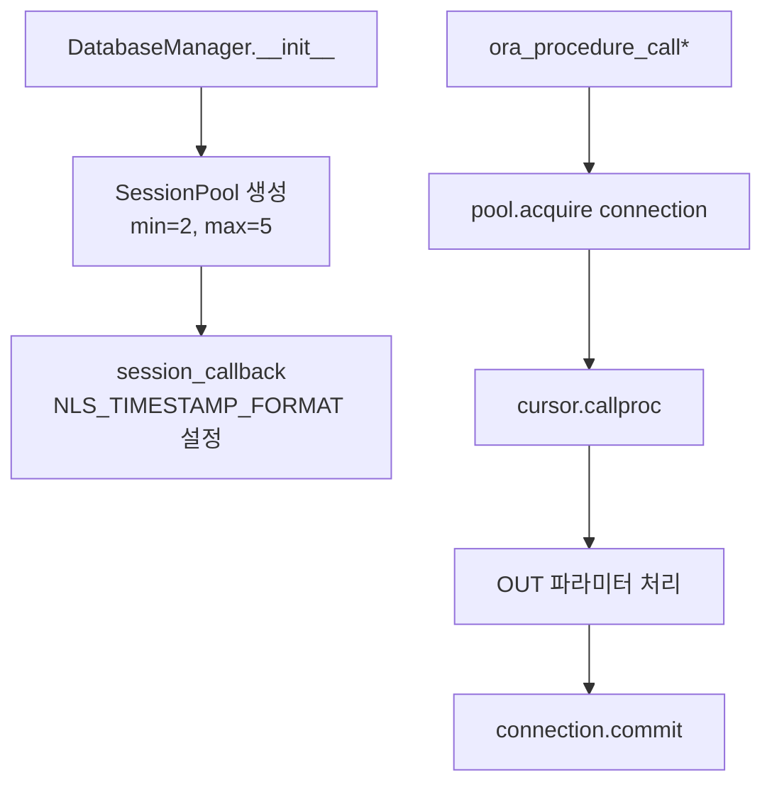

# oracle_db/oracle_store.py — Oracle 풀 / 프로시저 호출

`DatabaseManager` 클래스 — Oracle SessionPool 관리 + 프로시저 호출 wrapper.

## 한눈에 보는 구조



## 클래스: `DatabaseManager`

[L21-L40](../../../oracle_db/oracle_store.py#L21)

```python
class DatabaseManager:
    def __init__(self, user, password, dsn):
        def _init_session(conn, requested_tag):
            # NLS 설정 (매 connection acquire 시)
            cur = conn.cursor()
            cur.execute("ALTER SESSION SET NLS_TIMESTAMP_FORMAT='YYYYMMDDHH24MISS'")
            cur.execute("ALTER SESSION SET NLS_DATE_FORMAT='YYYYMMDDHH24MISS'")
            cur.close()

        self.connection_pool = cx_Oracle.SessionPool(
            user=user, password=password, dsn=dsn,
            min=2, max=5, increment=1, encoding="UTF-8",
            session_callback=_init_session,
        )
```

### SessionPool 옵션

| 옵션 | 값 | 의미 |
|---|---|---|
| `min` | 2 | 시작 시 미리 만들 connection 수 |
| `max` | 5 | 최대 connection 수 (운영 중) |
| `increment` | 1 | 추가 acquire 필요 시 한 번에 늘릴 수 |
| `encoding` | UTF-8 | 한국어 처리 |
| `session_callback` | `_init_session` | acquire 시 매번 호출 (NLS 설정) |

### `_init_session` 콜백

매 새 connection 생성 시 호출:
- `NLS_TIMESTAMP_FORMAT='YYYYMMDDHH24MISS'` — `save_check_result` 가 `to_char(sysdate,'yyyymmddhh24miss')` 형식 사용
- `NLS_DATE_FORMAT='YYYYMMDDHH24MISS'` — 동일 통일

⚠ 미설정 시 `ORA-01843: not a valid month` 에러 발생 가능.

## `cx_Oracle.py` shim

[../../cx_Oracle.py](../../../cx_Oracle.py)

기존 코드가 `cx_Oracle` API 를 사용 중인데, `python-oracledb` 로 마이그레이션:

```python
import oracledb as _o
from oracledb import *
CLOB=_o.DB_TYPE_CLOB; CURSOR=_o.DB_TYPE_CURSOR; STRING=_o.DB_TYPE_VARCHAR; NUMBER=_o.DB_TYPE_NUMBER
DatabaseError=_o.DatabaseError; Error=_o.Error; Timestamp=_o.Timestamp

def makedsn(host, port, sid=None, service_name=None):
    return _o.makedsn(host, port, sid=sid, service_name=service_name)

def init_oracle_client(lib_dir=None, **kw):
    return None   # thin mode 사용 — 무동작

def connect(*a, **kw):
    return _o.connect(*a, **kw)

def SessionPool(user, password, dsn, min=1, max=5, increment=1, encoding="UTF-8", **kw):
    return _o.create_pool(user=user, password=password, dsn=dsn, min=min, max=max, increment=increment, **kw)
```

→ thin mode (instantclient 불필요) 사용 중.

## 메서드 분류

### 핵심 (BL Check 가 사용하는 것)

#### `ora_procedure_call5(procedure_name, in_params, out_params, dataframe=True)`

[L504-L565](../../../oracle_db/oracle_store.py#L504)

**가장 많이 쓰는 프로시저 호출 함수** (OUT REFCURSOR 처리 포함).

```python
out_params = {
    "po_bl_list": "CURSOR",
    "po_status_code": "STRING",
    "po_errors": "CURSOR",
}
result = db_manager.ora_procedure_call5(
    procedure_name="LINER.pkg_ai_bl_check.get_check_target_bl_list",
    in_params={"pi_limit": 15},
    out_params=out_params,
    dataframe=True,
)
# result = {
#   "po_bl_list":    pd.DataFrame[BLNO],
#   "po_status_code": "SUCCESS",
#   "po_errors":     pd.DataFrame[error_code, error_message],
# }
```

**동작:**
1. `connection_pool.acquire()` → connection 얻음
2. `cursor.callproc(procedure_name, keywordParameters=procedure_args)`
3. OUT CURSOR → `pd.DataFrame` 변환 (or list)
4. OUT STRING / NUMBER → 그대로 값 반환
5. `connection.commit()` (프로시저 내부 INSERT 보존)
6. 에러 시 `cx_Oracle.DatabaseError` 잡아서 `None` 반환

#### `ora_procedure_call(procedure_name, in_params, out_params, dataframe=True)`

[L215-L280](../../../oracle_db/oracle_store.py#L215)

`call_sp_get_bl_header` 등이 사용. `ora_procedure_call5` 와 유사하지만 에러 시 `{"pStatus": "Error", "pResult": pd.DataFrame[Error]}` 반환 (None 아님).

#### `common_select(table, input_data, target_column, condition, dataframe=True)`

[L42-L70](../../../oracle_db/oracle_store.py#L42)

단순 SELECT wrapper.

```python
df = db_manager.common_select(
    table="LINER.T_AICHECK_TARGET",
    input_data={},
    target_column=["BLNO", "CHECKTP"],
    condition="CHECKTP='I'",
    dataframe=True,
)
```

#### `common_insert(table, data)`

[L79-L100](../../../oracle_db/oracle_store.py#L79)

단순 INSERT wrapper. dict 1건 또는 list-of-dict 다건.

### 기타 (다른 시스템에서 사용)

`ora_procedure_call*` 변형들:

| 메서드 | 라인 | 차이 |
|---|---|---|
| `ora_procedure_call6` | [L282](../../../oracle_db/oracle_store.py#L282) | df_to_oracle_cursor6 사용 |
| `ora_procedure_call_finnance` | [L356](../../../oracle_db/oracle_store.py#L356) | 금융 시스템용 |
| `ora_procedure_call10` | [L430](../../../oracle_db/oracle_store.py#L430) | df_to_oracle_cursor (V10) |
| `ora_procedure_call4` | [L625](../../../oracle_db/oracle_store.py#L625) | V4 |
| `ora_procedure_call3` | [L676](../../../oracle_db/oracle_store.py#L676) | V3 |
| `ora_procedure_call_outlook` | [L736](../../../oracle_db/oracle_store.py#L736) | Outlook 메일 |

`common_procedure_call_dict*` 시리즈:

| 메서드 | 라인 |
|---|---|
| `common_procedure_call` | [L166](../../../oracle_db/oracle_store.py#L166) |
| `common_procedure_call_dict` | [L844](../../../oracle_db/oracle_store.py#L844) |
| `common_procedure_call_dict2` | [L796](../../../oracle_db/oracle_store.py#L796) |
| `common_procedure_call_dict_clob` | [L875](../../../oracle_db/oracle_store.py#L875) |
| `common_procedure_call_dict_clob_V2` | [L910](../../../oracle_db/oracle_store.py#L910) |
| `common_procedure_call_dict_clob_2` | [L943](../../../oracle_db/oracle_store.py#L943) |

`df_to_oracle_cursor*` (DataFrame → Oracle CURSOR 변환):

| 메서드 | 라인 |
|---|---|
| `df_to_oracle_cursor` | [L1145](../../../oracle_db/oracle_store.py#L1145) |
| `df_to_oracle_cursor6` | [L1028](../../../oracle_db/oracle_store.py#L1028) |
| `df_to_oracle_cursor7` | [L1072](../../../oracle_db/oracle_store.py#L1072) |
| `df_to_oracle_cursor8` | [L1104](../../../oracle_db/oracle_store.py#L1104) |

→ 다른 시스템 (인사/송금/운임 등) 에서 사용. BL Check 는 직접 사용 X.

## OUT 파라미터 타입 매핑

```python
out_params = {
    "po_xxx": "CURSOR",   # → cx_Oracle.CURSOR (= oracledb.DB_TYPE_CURSOR)
    "po_yyy": "STRING",   # → cx_Oracle.STRING (= oracledb.DB_TYPE_VARCHAR)
    "po_zzz": "NUMBER",   # → cx_Oracle.NUMBER (= oracledb.DB_TYPE_NUMBER)
}
```

내부 변환 ([L520-L528](../../../oracle_db/oracle_store.py#L520)):

```python
for param, p_type in out_params.items():
    if p_type == 'CURSOR':
        out_vars[param] = cursor.var(cx_Oracle.CURSOR)
    elif p_type == 'STRING':
        out_vars[param] = cursor.var(cx_Oracle.STRING, size=50)
    elif p_type == 'NUMBER':
        out_vars[param] = cursor.var(cx_Oracle.NUMBER)
```

## thin mode vs thick mode

| 모드 | 특징 | 현재 |
|---|---|---|
| **thin mode** | pure Python, instantclient 불필요 | ✅ 사용 중 |
| thick mode | Oracle instantclient 필요, 더 안정적 wire protocol | 미사용 (이전 시도 후 ThreadPoolExecutor 호환 이슈로 보류) |

→ thick mode 전환은 테스트 환경에서 검증 후 결정.

## 알려진 이슈

### thin mode 의 `SQL*Net more data from client` hang

- 좀비 세션이 row lock 잡고 있을 때 thin mode 의 callproc 가 wire protocol 레벨에서 무한 대기
- DBeaver(JDBC) 는 영향 없음, oracledb thin mode 만 hang
- **대응:** [트러블슈팅](../../operations/troubleshooting.md) 참고. DBA KILL 또는 thick mode 전환.

### 좀비 세션 생성 메커니즘

```
1. cursor.callproc 진행 중
2. 어떤 이유로 응답 못 받음 (hang)
3. SHELL_TIMEOUT 으로 SIGKILL
4. TCP 비정상 종료 → DB 측 disconnect 감지 안 됨
5. ★ 좀비 세션 발생 (ACTIVE 상태, row lock 보유)
```

**예방 (테스트 검증 후 운영 반영 권장):**
- `connection.call_timeout = 90000` (90초) 설정
- 90초 후 자동 abort → 좀비 안 만듦

## 비밀번호 하드코딩 위치

⚠ `database_handler.py` 의 여러 함수에서 비밀번호 하드코딩. 향후 환경변수화 권장.

```python
# 현재 (database_handler.py 13곳)
db_manager = DatabaseManager(
    user="liner",
    password="SinokorMan0823",
    dsn=cx_Oracle.makedsn("192.168.1.3", 9889, service_name="skr"),
)

# 권장
db_manager = DatabaseManager(
    user=os.environ["DB_USER"],
    password=os.environ["DB_PWD"],
    dsn=cx_Oracle.makedsn(*os.environ["DB_HOST_PORT"].split(":"), service_name=os.environ["DB_SERVICE"]),
)
```

## 관련 문서

- [database_handler.py](database-handler.md)
- [DB 프로시저](procedures.md)
- [트러블슈팅](../../operations/troubleshooting.md)
