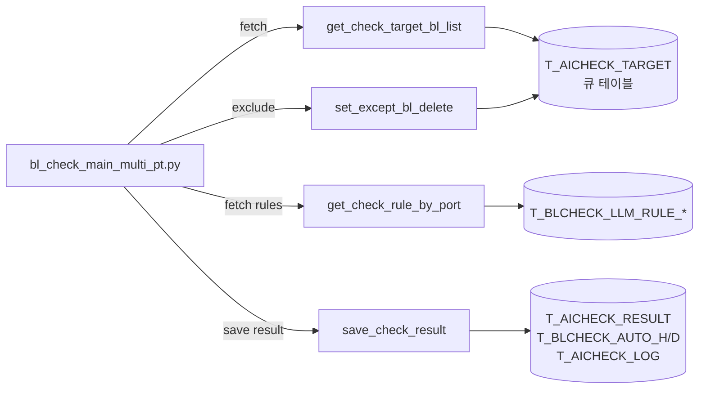
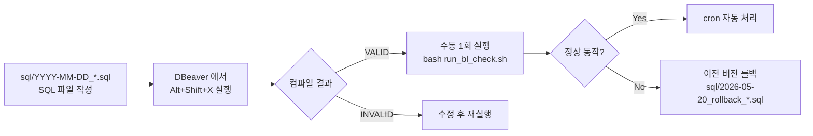

# DB 프로시저 (`LINER.pkg_ai_bl_check`)

BL Check 시스템의 핵심 DB 로직. 4개 procedure 로 구성.

## 패키지 개요



## 1) `get_check_target_bl_list`

**처리 대상 BL 리스트 조회 + 상태 변경.**

### 시그니처

```sql
PROCEDURE get_check_target_bl_list(
    po_bl_list     OUT SYS_REFCURSOR,
    po_status_code OUT VARCHAR2,
    po_errors      OUT SYS_REFCURSOR
)
```

### 동작 (현재 운영 — 5/20 롤백 버전)

```sql
BEGIN
    DELETE FROM LINER.TMP_ERRINFO;

    -- Step 1: 'I' → 'U' (모든 행 한 번에)
    UPDATE LINER.T_AICHECK_TARGET
       SET CHECKTP = 'U'
     WHERE CHECKTP = 'I';

    -- Step 2: 'U' 상태 모든 BL 반환 (MIN(INPDATE) 정렬)
    OPEN po_bl_list FOR
        SELECT BLNO FROM (
            SELECT BLNO, MIN(INPDATE) INPDATE
              FROM LINER.T_AICHECK_TARGET
             WHERE CHECKTP = 'U'
             GROUP BY BLNO
        ) ORDER BY INPDATE ASC;

    po_status_code := 'SUCCESS';
    OPEN po_errors FOR SELECT compcd, perr FROM LINER.TMP_ERRINFO;
    COMMIT;
END;
```

### 변경 이력

| 버전 | 시점 | 특징 |
|---|---|---|
| **원본 (5/19 이전)** | - | `MAX(INPDATE)` 정렬 → starvation 발생 |
| **5/19 GTT + MIN + pi_limit** | 사용자가 직접 패치 | TMP_TARGET_BL GTT 사용 + pi_limit 파라미터 |
| **5/19 SKIP LOCKED 패치** | 좀비 사건 대응 | cursor FOR UPDATE SKIP LOCKED |
| **5/20 롤백 (현재 운영)** | 안정성 우선 | 원본 + `MIN(INPDATE)` 변경만 |

이전 SQL 패치는 [sql/](../../../sql/) 디렉토리에 보존.

### 향후 개선안 (테스트 검증 후)

```sql
-- pi_limit 파라미터 + GTT + SKIP LOCKED
PROCEDURE get_check_target_bl_list(
    pi_limit       IN  NUMBER       DEFAULT NULL,
    po_bl_list     OUT SYS_REFCURSOR,
    ...
) IS BEGIN
    DELETE FROM TMP_TARGET_BL;

    DECLARE CURSOR c IS
        SELECT ROWID rid, BLNO FROM T_AICHECK_TARGET
        WHERE CHECKTP='I' ORDER BY INPDATE
        FOR UPDATE SKIP LOCKED;
    BEGIN
        FOR r IN c LOOP
            EXIT WHEN v_cnt >= NVL(pi_limit, 999999);
            INSERT INTO TMP_TARGET_BL VALUES (r.BLNO);
            UPDATE T_AICHECK_TARGET SET CHECKTP='U' WHERE ROWID = r.rid;
            v_cnt := v_cnt + 1;
        END LOOP;
    END;

    OPEN po_bl_list FOR SELECT BLNO FROM TMP_TARGET_BL ORDER BY BLNO;
END;
```

→ 좀비 row 자동 회피 + 정확히 pi_limit 건만 처리.

## 2) `set_except_bl_delete`

**처리 대상이 아닌 BL 을 큐에서 자동 삭제 + 로그 기록.**

### 시그니처

```sql
PROCEDURE set_except_bl_delete(
    pi_bl_no       IN  VARCHAR2,
    po_status_code OUT VARCHAR2,
    po_errors      OUT SYS_REFCURSOR
)
```

### 동작

```sql
BEGIN
    DELETE FROM LINER.TMP_ERRINFO;

    -- 1. 로그 기록
    INSERT INTO LINER.T_AICHECK_LOG (BLNO, STATUS, REMARK)
    VALUES (pi_bl_no, 'E', '처리 대상 BL이 아님.');

    -- 2. 큐에서 삭제
    DELETE FROM LINER.T_AICHECK_TARGET
     WHERE BLNO = pi_bl_no
       AND CHECKTP = 'U';

    po_status_code := 'SUCCESS';
    COMMIT;
END;
```

### 호출 시점

`BlHeaderDeleteTargetError` 발생 시 ([main.py:894](../../../bl_check_main_multi_pt.py#L894)):
- BL Header 없음
- 필수 컬럼 누락
- 'blno 결과 조회되지 않음'

## 3) `get_check_rule_by_port`

**포트 별 적용 룰 조회 (4개 테이블 JOIN).**

### 시그니처

```sql
PROCEDURE get_check_rule_by_port(
    pi_nation_cd   IN  VARCHAR2,
    pi_port_cd     IN  VARCHAR2,
    po_status_code OUT VARCHAR2,
    po_rule_list   OUT SYS_REFCURSOR,
    po_errors      OUT SYS_REFCURSOR
)
```

### 핵심 쿼리

```sql
SELECT DISTINCT
    HD.RULE_TITLE       AS PORT_DESC,
    TG.TARGET_FIELD     AS TARGET_DESC,
    DT.UPDATE_DT        AS UPD_DATE,
    DT.UPDATE_USER      AS UPD_USER,
    DECODE(TG.COND_TYPE,
        'N','공통 적용',
        'T','TO ORDER 인 경우 제외',
        'F','SAME AS...인 경우 제외',
        'D','DG 인 경우만 체크',
        'R','REEFER인 경우만 체크',
        'O','AWKWARD인 경우 체크',
        'I','INLAND인 경우 체크'
    ) AS delivery_type_yn,
    '' MSG_TYPE
FROM T_BLCHECK_LLM_RULE       HD
JOIN T_BLCHECK_LLM_RULE_DETAIL DT ON HD.RULE_ID = DT.RULE_ID
JOIN T_BLCHECK_LLM_RULE_TGT    TG ON HD.RULE_ID = TG.RULE_ID
JOIN T_BLCHECK_LLM_RULE_PORT   PT ON HD.RULE_ID = PT.RULE_ID
WHERE HD.USE_YN='Y' AND DT.USE_YN='Y'
  AND (pi_nation_cd IS NULL OR PT.PORT_CODE LIKE pi_nation_cd||'%' OR PT.PORT_CODE = pi_nation_cd||'ALL' OR PT.PORT_CODE='ALL')
  AND (pi_port_cd   IS NULL OR PT.PORT_CODE = pi_port_cd OR PT.PORT_CODE = SUBSTR(pi_port_cd,1,2)||'ALL' OR PT.PORT_CODE='ALL')
ORDER BY DECODE(TG.TARGET_FIELD, 
    'SHIPPER',1, 'CONSIGNEE',2, 'NOTIFY',3,
    'MARK_AND_DESC',4, 'DG_MARK_AND_DESC',5, 'RF_MARK_AND_DESC',6, 7);
```

### 호출 시점

`get_port_check_details(db, port_code)` ([database_handler.py:343](../../../database_management/database_handler.py#L343)) 에서 호출.

## 4) `save_check_result`

**AI 체크 결과를 3개 테이블에 저장 + 큐에서 삭제.**

### 시그니처

```sql
PROCEDURE save_check_result(
    pi_payload_obj IN  JSON_OBJECT_T,    -- BLNO + results 배열
    po_success     OUT BOOLEAN
)
```

### Payload 구조

```json
{
  "blno": "SNKO010260504188",
  "results": [
    {
      "rule_code": "001",
      "rule": "BANK 명칭이 있는 경우...",
      "status": "true",       // PASS
      "reason": "BANK 없음, 정상",
      "source_block": "SHIPPER",
      "model_nm": "gpt-5.4-mini"
    },
    {
      "rule_code": "007",
      "rule": "POD=INCCU & FINAL=NEPAL 이면 EXIM 코드 필요",
      "status": "false",      // FAIL
      "reason": "EXIM 코드 미기재",
      "source_block": "MARK_AND_DESC",
      "model_nm": "gpt-5.4-mini"
    }
  ],
  "flags": {
    "CONSIGNEE_IS_ORDER_INSTRUCTION": false,
    "NOTIFY_IS_SAME_AS_CONSIGNEE": false,
    "SHIPPER_OF_INSTRUCTION": false
  }
}
```

### 동작

```sql
DECLARE
    v_blno     VARCHAR2(20);
    v_inptime  VARCHAR2(14);
BEGIN
    v_inptime := TO_CHAR(SYSDATE, 'yyyymmddhh24miss');
    v_blno    := pi_payload_obj.get_string('blno');

    -- 1. 기존 결과 삭제 (재처리 케이스)
    DELETE FROM LINER.T_BLCHECK_AUTO_D WHERE BLNO = v_blno AND SRC = 'AI';

    -- 2. T_AICHECK_RESULT INSERT (룰별 N개)
    INSERT INTO LINER.T_AICHECK_RESULT (
        BLNO, RULE_CODE, RULE_DESCRIPTION, CHECK_BLOCK,
        CHECK_RESULT, REASON, INPDATE, MODEL_NM
    )
    SELECT v_blno, t.rule_code, t.rule, t.source_block,
           CASE WHEN t.status = 'true' THEN 'Y' ELSE 'N' END,
           t.reason, SYSTIMESTAMP,
           NVL(t.model_nm, NVL(SUBSTR(t.reason, 1, 6), 'NONE'))
    FROM JSON_TABLE(v_json_str, '$.results[*]' COLUMNS (...)) t;

    -- 3. T_BLCHECK_AUTO_H INSERT (헤더 1 row)
    INSERT INTO LINER.T_BLCHECK_AUTO_H (
        SRC, BLNO, EVENT, PASS, AUTOYN, INPUSER, INPDATE
    )
    SELECT 'AI', BLNO, EVENT,
           (SELECT CASE WHEN COUNT(CASE WHEN status='false' THEN 1 END) > 0
                        THEN 'N' ELSE 'Y' END
            FROM JSON_TABLE(v_json_str, '$.results[*]' COLUMNS (status VARCHAR2(10) PATH '$.status'))
           ) AS PASS,
           'N', 'ADMIN', v_inptime
    FROM T_AICHECK_TARGET A WHERE A.BLNO = v_blno AND CHECKTP='U';

    -- 4. T_BLCHECK_AUTO_D INSERT (룰별 N개)
    INSERT INTO LINER.T_BLCHECK_AUTO_D (
        SRC, CHKTP, DESCTP, BLNO, ERRORLINE,
        ENGERRMSG, LOCERRMSG, CUSTSENDYN, EMPSENDYN, INPUSER, INPDATE
    )
    SELECT 'AI',
           CASE WHEN t.status = 'true' THEN 'PASS' ELSE 'FAIL' END,
           t.source_block, v_blno,
           SUBSTR(t.rule_code, -3),
           t.reason, t.reason, '', '', 'ADMIN', v_inptime
    FROM JSON_TABLE(v_json_str, '$.results[*]' COLUMNS (...)) t;

    -- 5. 정상 로그
    INSERT INTO LINER.T_AICHECK_LOG (BLNO, STATUS, REMARK)
    VALUES (v_blno, 'S', '정상 처리 완료.');

    -- 6. 큐에서 삭제 (처리 완료)
    DELETE FROM T_AICHECK_TARGET WHERE BLNO = v_blno AND CHECKTP = 'U';

    COMMIT;
    po_success := TRUE;
END;
```

### 호출 시점

[bl_check_main_multi_pt.py:1014](../../../bl_check_main_multi_pt.py#L1014):

```python
ingest_dict = {
    "pi_task_code": "BL_CKECK_RESULT",
    "pi_payload":   json.dumps(result, ensure_ascii=False),
}
status = load_ingest_req(ingest_dict, user)  # → save_check_result 호출
```

## 패키지 컴파일 상태 확인

```sql
SELECT object_name, object_type, status, last_ddl_time
FROM all_objects
WHERE owner='LINER' AND object_name='PKG_AI_BL_CHECK'
ORDER BY object_type;
```

→ `STATUS = VALID` 이고 `last_ddl_time` 이 최근 시각이면 정상.

## 프로시저 변경 절차



## 패키지 SPEC vs BODY

| 항목 | 역할 | 변경 시 |
|---|---|---|
| **PACKAGE** (SPEC) | 인터페이스 (시그니처 선언) | 시그니처 변경 시 SPEC 도 함께 변경 필요 |
| **PACKAGE BODY** | 구현 | 로직만 바꾸면 BODY 만 |

SPEC 변경 시 BODY 자동으로 INVALID → BODY 재컴파일 필요.

## 보존된 SQL 파일

[`sql/`](../../../sql/) 디렉토리:

```
sql/
├── 2026-05-19_skip_locked_patch.sql       # SKIP LOCKED 패치 (테스트 후 운영 반영 가능)
├── 2026-05-20_rollback_to_original.sql    # 5/19 이전 원본 + MIN 변경 (현재 운영)
└── 2026-05-20_rollback_spec.sql           # SPEC 도 함께 롤백
```

## 관련 문서

- [데이터 모델](../data-model.md)
- [database_handler.py](database-handler.md)
- [트러블슈팅](../../operations/troubleshooting.md)
