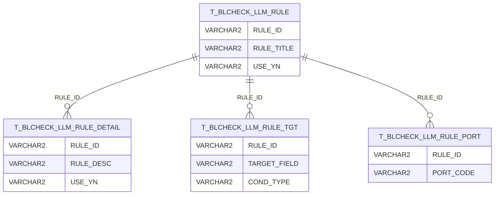
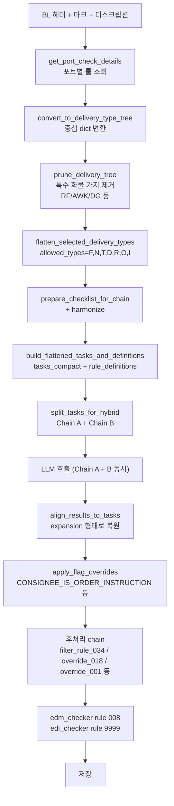

# 룰 정의 (Rule Catalog)

BL Check 가 검증하는 33+ 종 룰의 정의와 적용 방식.

## 룰 구조 (DB)

룰은 4개 테이블로 정규화되어 있습니다 ([데이터 모델](data-model.md) 참고):



## 적용 블록 (`TARGET_FIELD`)

| 블록 | 의미 |
|---|---|
| `SHIPPER` | 송하인 (Shipper) |
| `CONSIGNEE` | 수하인 (Consignee) |
| `NOTIFY` | 통지처 (Notify Party) |
| `MARK_AND_DESC` | 마크 + 디스크립션 (일반 룰) |
| `DG_MARK_AND_DESC` | DG (위험물) 마크 + 디스크립션 |
| `RF_MARK_AND_DESC` | RF (냉동) 마크 + 디스크립션 |

## 적용 조건 (`COND_TYPE`)

| 코드 | 의미 |
|---|---|
| `N` | 공통 적용 (모든 BL) |
| `T` | TO ORDER 인 경우 제외 |
| `F` | SAME AS... 인 경우 제외 |
| `D` | DG (Dangerous Goods) 인 경우만 |
| `R` | REEFER (냉동) 인 경우만 |
| `O` | AWKWARD 인 경우만 |
| `I` | INLAND 인 경우만 |

## 포트 적용 (`PORT_CODE`)

| 패턴 | 적용 범위 |
|---|---|
| `ALL` | 전체 포트 |
| `INALL` | India 전체 (`IN*`) — ⚠ 좁은 적용 권장 |
| `INCCU` | 콜카타 (India Kolkata) |
| `CNSHA` | 상하이 (China Shanghai) |
| `KRPUS` | 부산 (Korea Pusan) |
| `JPYOK` | 요코하마 (Japan Yokohama) |
| `RU*` | 러시아 (Russia 전체) |
| (...) | 5자리 포트 코드 + ALL 패턴 |

## 룰 코드별 개요 (현재 운영 중인 33+ 종)

> 정확한 룰 본문은 DB 의 `T_BLCHECK_LLM_RULE_DETAIL.RULE_DESC` 또는 [configs/rules_kr.json](../../configs/rules_kr.json) 참고.

### Party 정보 룰 (SHIPPER / CONSIGNEE / NOTIFY)

| 룰 코드 | 제목 (요약) |
|---|---|
| `001` | 회사명 + 법인 토큰 (CO., LTD., PT, SDN BHD 등) — placeholder ('ONE LINE', 'TBD') 시 FAIL |
| `003` | 주소 정합성 (국가 매칭) |
| `005` | TEL / FAX |
| `006` | EMAIL / 추가 연락처 |
| `007` | EXIM 코드 — POD=INCCU + FINAL=NEPAL 인 경우만 적용 (2026-05-19 변경) |
| `008` | EDM RD 문서 존재 여부 (자동 통과 처리 가능) |
| `010` | (포트 별 특수) |
| `011`, `012`, `013` | (블록 별 특수) |
| `016` | (포트/케이스 별 특수) |
| `018` | placeholder 본문 검증 (override 적용) |
| `019` | (포트 별 특수) |
| `020` | (포트 별 특수) |
| `021`, `022` | NOTIFY 관련 (cross-block 차단 — 현재 override 미적용) |
| `023` | (블록 별 특수) |
| `025`~`029` | (포트 별 특수) |
| `030`, `031` | DG / RF 관련 |
| `032`, `033` | (특수 케이스) |
| `034` | DG 마크/디스크립션 — rule 008 조건부 필터링 |

### 특수 룰

| 룰 코드 | 제목 |
|---|---|
| `9999` | **SHIPPER OF INSTRUCTION (MF Type C/S 체크)** — 코드 측에서 결정 (LLM 결과 X) |

## 룰 적용 흐름



## 코드 측 룰 처리 함수

[pycomms_toolkit/rules.py](../../pycomms_toolkit/rules.py)

| 함수 | 역할 |
|---|---|
| `prune_delivery_tree(tree, special)` | DG/RF/AWK 적용 안 되는 가지 제거 |
| `flatten_selected_delivery_types` | 트리 → flat 변환 |
| `prepare_checklist_for_chain` | 체인 호출용 변환 |
| `harmonize_checklist_for_chain` | 정규화 |
| `build_tasks_from_rules(rules)` | tasks (expansion) |
| `build_flattened_tasks_and_definitions` | compact + definitions |
| `split_tasks_for_hybrid` | Chain A / Chain B 분리 |
| `align_results_to_tasks` | 응답 → expansion 복원 |
| `sanitize_llm_input_text` | 입력 정제 |
| `filter_rule_034_by_rule_008` | rule 034 조건부 |
| `post_process_notify_tax_rules` | NOTIFY tax (미사용) |
| `override_rule_018(result, payload)` | rule 018 placeholder 오탐 방지 |
| `override_rule_001_placeholder(result, payload)` | rule 001 placeholder 강제 FAIL |
| `override_rule_021_022_notify` | rule 021/022 NOTIFY (미사용 — 회귀) |

## 룰 한국어 설명

[configs/rules_kr.json](../../configs/rules_kr.json) — 룰별 한국어 본문.

```json
{
  "001": "BANK 명칭이 있는 경우...",
  "007": "최종 목적지(FINAL DEST)가 네팔(NEPAL)인 경우...",
  "034": "DG 마크/디스크립션 검증..."
}
```

`replace_rule_with_port_desc` ([database_handler.py:64](../../../database_management/database_handler.py#L64)) 가 LLM 결과의 `rule_code` 를 이 한국어 설명으로 치환.

## 룰 변경 / 추가 시

### 1) DB 측 (룰 자체)

```sql
-- 1. 새 룰 추가
INSERT INTO LINER.T_BLCHECK_LLM_RULE (RULE_ID, RULE_TITLE, USE_YN)
VALUES ('035', '신규 룰 제목', 'Y');

-- 2. 본문
INSERT INTO LINER.T_BLCHECK_LLM_RULE_DETAIL (RULE_ID, RULE_DESC, USE_YN, UPDATE_DT, UPDATE_USER)
VALUES ('035', '룰 본문 (LLM 에게 전달될 instruction)', 'Y', SYSDATE, 'ADMIN');

-- 3. 적용 블록
INSERT INTO LINER.T_BLCHECK_LLM_RULE_TGT (RULE_ID, TARGET_FIELD, COND_TYPE)
VALUES ('035', 'SHIPPER', 'N');

-- 4. 적용 포트
INSERT INTO LINER.T_BLCHECK_LLM_RULE_PORT (RULE_ID, PORT_CODE)
VALUES ('035', 'KRPUS');  -- 또는 'ALL'

COMMIT;
```

### 2) 코드 측 후처리 (옵션)

특정 룰에 도메인 로직이 추가되어야 하면 `pycomms_toolkit/rules.py` 에 override 함수 추가:

```python
def override_rule_035(result, payload):
    """rule 035 특수 케이스 — XYZ 패턴 발견 시 강제 FAIL"""
    for r in result.get("results", []):
        if r.get("rule_code") == "035":
            if "XYZ" in payload:
                r["status"] = False
                r["reason"] = "[OVERRIDE rule_035] XYZ 패턴 발견"
    return result
```

`bl_check_main_multi_pt.py:handle_one` 에서 호출:

```python
result = override_rule_035(result, ctx.get("second_payload", ""))
```

## 알려진 룰 사고 이력

### 2026-05-19 rule 007 적용 범위 오류

- **증상:** POD 가 INDIA 인 모든 BL 에 rule 007 적용 → 잘못 FAIL 다수
- **원인:** `T_BLCHECK_LLM_RULE_PORT.PORT_CODE = 'INALL'` (India 전체)
- **수정:** `INALL` → `INCCU` (콜카타만)

```sql
UPDATE LINER.T_BLCHECK_LLM_RULE_PORT
SET PORT_CODE = 'INCCU'
WHERE RULE_ID = '007' AND PORT_CODE = 'INALL';
COMMIT;
```

→ 그 후 영향 받은 BL 들 수동 PASS 처리.

## 룰 분포 통계 (DB 조회)

```sql
-- 룰별 적용 포트 수
SELECT r.RULE_ID, r.RULE_TITLE,
       LISTAGG(p.PORT_CODE, ',') WITHIN GROUP (ORDER BY p.PORT_CODE) AS ports
FROM LINER.T_BLCHECK_LLM_RULE r
JOIN LINER.T_BLCHECK_LLM_RULE_PORT p ON r.RULE_ID = p.RULE_ID
WHERE r.USE_YN = 'Y'
GROUP BY r.RULE_ID, r.RULE_TITLE
ORDER BY r.RULE_ID;

-- 룰별 적용 블록 수
SELECT r.RULE_ID, r.RULE_TITLE,
       LISTAGG(t.TARGET_FIELD || ':' || t.COND_TYPE, ',') WITHIN GROUP (ORDER BY t.TARGET_FIELD) AS targets
FROM LINER.T_BLCHECK_LLM_RULE r
JOIN LINER.T_BLCHECK_LLM_RULE_TGT t ON r.RULE_ID = t.RULE_ID
GROUP BY r.RULE_ID, r.RULE_TITLE;
```

## 룰 별 PASS / FAIL 통계

운영 후 분석용:

```sql
-- 최근 7일 룰별 FAIL 건수 Top 10
SELECT RULE_CODE,
       COUNT(*) AS total,
       SUM(CASE WHEN CHECK_RESULT='N' THEN 1 ELSE 0 END) AS fail_cnt,
       ROUND(SUM(CASE WHEN CHECK_RESULT='N' THEN 1 ELSE 0 END) * 100.0 / COUNT(*), 1) AS fail_rate_pct
FROM LINER.T_AICHECK_RESULT
WHERE INPDATE >= SYSTIMESTAMP - INTERVAL '7' DAY
GROUP BY RULE_CODE
ORDER BY fail_cnt DESC
FETCH FIRST 10 ROWS ONLY;
```

→ FAIL 률 높은 룰을 발견하면 (1) 룰 본문 조정, (2) 적용 범위 축소, (3) override 추가 검토.

## 관련 문서

- [데이터 모델](data-model.md)
- [AI 파이프라인](ai-pipeline.md)
- [LLM_extractor/](modules/llm-extractor.md)
- [DB 프로시저](modules/procedures.md)
